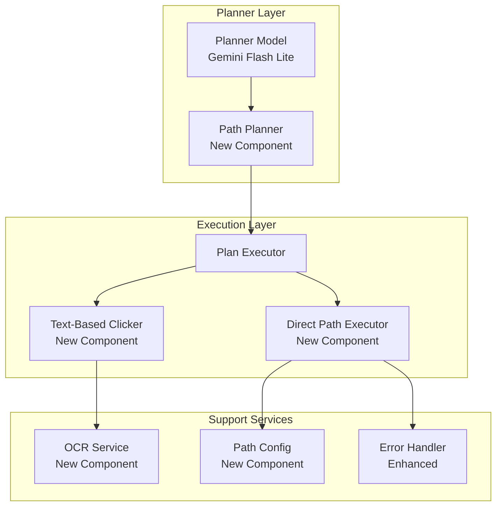
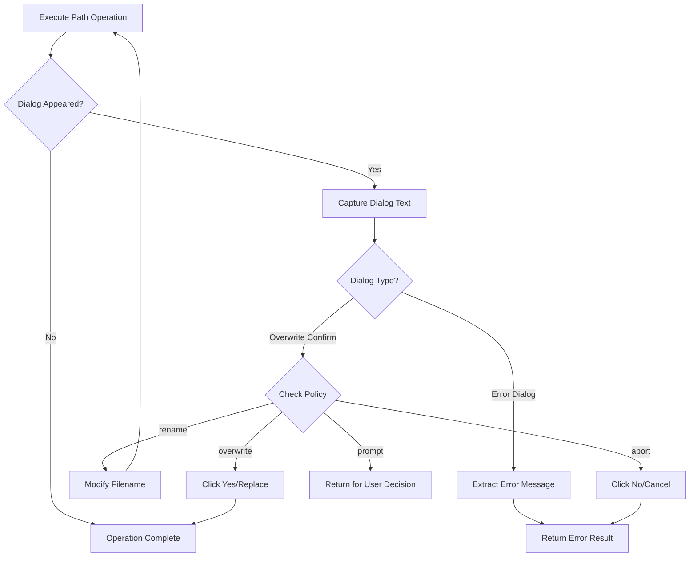

# Design Document: Direct Path Automation

## Overview

Direct Path Automation is a feature that optimizes file operations in the automation pipeline by using direct path typing instead of UI navigation. This approach leverages the fact that Windows file dialogs (Save As, Open) accept full absolute paths in the filename field, eliminating the need for expensive vision-based folder navigation.

The feature introduces three new capabilities:
1. **Direct Path File Operations** - Type full paths in Save/Open dialogs
2. **File Explorer Address Bar Navigation** - Use Ctrl+L to navigate directly to directories
3. **Text-Based Element Clicking** - OCR-based clicking for selecting files by name

This design reduces API costs (fewer vision model calls), increases reliability (deterministic path typing vs. visual element detection), and improves speed (no folder-by-folder navigation).

## Architecture



## Components and Interfaces

### 1. Path Configuration (PathConfig)

Manages default paths and automation policies.

```python
@dataclass
class PathConfig:
    """Configuration for direct path automation."""
    default_save_directory: str  # e.g., "C:\\Users\\harsh\\OneDrive\\Desktop"
    default_open_directory: str  # e.g., "C:\\Users\\harsh\\Documents"
    overwrite_policy: str  # "overwrite", "rename", "abort", "prompt"
    config_file_path: str  # Path to JSON config file
    
    @classmethod
    def load(cls, config_path: str = None) -> 'PathConfig':
        """Load configuration from JSON file or use defaults."""
        pass
    
    def save(self) -> None:
        """Save current configuration to file."""
        pass
    
    def get_full_save_path(self, filename: str, directory: str = None) -> str:
        """Construct full save path with defaults."""
        pass
    
    def get_full_open_path(self, filename: str, directory: str = None) -> str:
        """Construct full open path."""
        pass
```

### 2. Direct Path Executor (DirectPathExecutor)

Executes file operations using direct path typing.

```python
class DirectPathExecutor:
    """Executes file save/open operations via direct path typing."""
    
    def __init__(self, config: PathConfig):
        self.config = config
        self.error_handler = ErrorHandler()
    
    def execute_save(self, full_path: str) -> ExecutionResult:
        """
        Execute a save operation:
        1. Press Ctrl+S
        2. Wait for dialog
        3. Type full path
        4. Press Enter
        5. Handle any error/confirmation dialogs
        """
        pass
    
    def execute_open(self, full_path: str) -> ExecutionResult:
        """
        Execute an open operation:
        1. Press Ctrl+O
        2. Wait for dialog
        3. Type full path
        4. Press Enter
        5. Handle any error dialogs
        """
        pass
    
    def navigate_explorer(self, directory_path: str) -> ExecutionResult:
        """
        Navigate File Explorer to a directory:
        1. Press Ctrl+L to focus address bar
        2. Type directory path
        3. Press Enter
        """
        pass
    
    def _wait_for_dialog(self, timeout: float = 2.0) -> bool:
        """Wait for a file dialog to appear."""
        pass
    
    def _handle_overwrite_dialog(self) -> bool:
        """Handle file overwrite confirmation dialog."""
        pass
```

### 3. OCR Service (OCRService)

Provides text detection and location for text-based clicking.

```python
@dataclass
class TextLocation:
    """Location of detected text on screen."""
    text: str
    bbox: tuple[int, int, int, int]  # x1, y1, x2, y2
    confidence: float
    center: tuple[int, int]  # Calculated center point

class OCRService:
    """OCR service for text-based element detection."""
    
    def __init__(self):
        # Use Windows OCR or Tesseract
        pass
    
    def detect_text(self, image: np.ndarray) -> list[TextLocation]:
        """Detect all text in an image with bounding boxes."""
        pass
    
    def find_text(self, image: np.ndarray, target_text: str, 
                  fuzzy: bool = True) -> list[TextLocation]:
        """Find specific text in an image."""
        pass
    
    def find_text_in_region(self, image: np.ndarray, target_text: str,
                            region: tuple[int, int, int, int]) -> TextLocation | None:
        """Find text within a specific screen region."""
        pass
```

### 4. Text-Based Clicker (TextBasedClicker)

Clicks on UI elements by finding their text labels.

```python
class TextBasedClicker:
    """Click on elements by finding their text on screen."""
    
    def __init__(self, ocr_service: OCRService):
        self.ocr = ocr_service
    
    def click_text(self, target_text: str, 
                   region: tuple[int, int, int, int] = None) -> ClickResult:
        """
        Find and click on text:
        1. Capture screenshot
        2. Run OCR to find target text
        3. Calculate center of bounding box
        4. Click at center
        """
        pass
    
    def click_file_in_explorer(self, filename: str) -> ClickResult:
        """
        Click on a file in File Explorer:
        1. Capture screenshot
        2. Find filename text in file list region
        3. Click center of filename
        """
        pass
    
    def double_click_text(self, target_text: str) -> ClickResult:
        """Double-click on text (for opening files)."""
        pass
```

### 5. Enhanced Plan Executor Integration

New step types for the Plan Executor:

```python
# New step types to add to PlanExecutor

DIRECT_PATH_STEP_TYPES = {
    'save_file': {
        'params': ['path'],  # Full path including filename
        'optional': ['overwrite_policy']
    },
    'open_file': {
        'params': ['path'],  # Full path to file
    },
    'navigate_explorer': {
        'params': ['directory'],  # Directory path
    },
    'click_text': {
        'params': ['text'],  # Text to find and click
        'optional': ['region', 'double_click']
    }
}
```

### 6. Enhanced Planner Model Prompts

Addition to the system prompt for path-aware planning:

```
## Direct Path Operations:
For file save/open operations, use direct path typing instead of UI navigation:

### Save File:
{
  "type": "save_file",
  "path": "C:\\Users\\harsh\\OneDrive\\Desktop\\document.txt",
  "desc": "Save file to Desktop"
}

### Open File:
{
  "type": "open_file", 
  "path": "C:\\Users\\harsh\\Documents\\report.pdf",
  "desc": "Open report PDF"
}

### Navigate Explorer:
{
  "type": "navigate_explorer",
  "directory": "C:\\Users\\harsh\\Downloads",
  "desc": "Navigate to Downloads folder"
}

### Click Text (for File Explorer file selection):
{
  "type": "click_text",
  "text": "report.pdf",
  "double_click": true,
  "desc": "Double-click to open report.pdf"
}

IMPORTANT: Always use full absolute paths with proper escaping (double backslashes in JSON).
```

## Data Models

### Execution Plan Step Types

```python
@dataclass
class SaveFileStep:
    """Step to save a file using direct path."""
    order: int
    type: str = "save_file"
    path: str  # Full absolute path
    overwrite_policy: str = "prompt"  # "overwrite", "rename", "abort", "prompt"
    desc: str = ""

@dataclass
class OpenFileStep:
    """Step to open a file using direct path."""
    order: int
    type: str = "open_file"
    path: str  # Full absolute path
    desc: str = ""

@dataclass
class NavigateExplorerStep:
    """Step to navigate File Explorer to a directory."""
    order: int
    type: str = "navigate_explorer"
    directory: str  # Directory path
    desc: str = ""

@dataclass
class ClickTextStep:
    """Step to click on text found via OCR."""
    order: int
    type: str = "click_text"
    text: str  # Text to find
    double_click: bool = False
    region: tuple[int, int, int, int] | None = None  # Optional region constraint
    desc: str = ""
```

### Execution Results

```python
@dataclass
class ExecutionResult:
    """Result of a direct path operation."""
    success: bool
    operation: str  # "save", "open", "navigate", "click_text"
    path: str | None
    error_type: str | None  # "file_exists", "path_not_found", "permission_denied", etc.
    error_message: str | None
    dialog_detected: str | None  # Text from any error dialog

@dataclass
class ClickResult:
    """Result of a text-based click operation."""
    success: bool
    target_text: str
    clicked_location: tuple[int, int] | None
    all_matches: list[TextLocation]  # All instances found
    error_message: str | None
```

### Configuration Schema

```json
{
  "direct_path_config": {
    "default_save_directory": "C:\\Users\\harsh\\OneDrive\\Desktop",
    "default_open_directory": "C:\\Users\\harsh\\Documents",
    "overwrite_policy": "prompt",
    "dialog_wait_timeout": 2.0,
    "ocr_confidence_threshold": 0.7
  }
}
```


## Correctness Properties

*A property is a characteristic or behavior that should hold true across all valid executions of a system-essentially, a formal statement about what the system should do. Properties serve as the bridge between human-readable specifications and machine-verifiable correctness guarantees.*

### Property 1: Save Plan Generation Correctness
*For any* save file command with a valid filename, the generated execution plan SHALL contain a sequence starting with Ctrl+S, followed by typing the full absolute path, followed by Enter.
**Validates: Requirements 1.1, 1.2**

### Property 2: Open Plan Generation Correctness
*For any* open file command with a valid file path, the generated execution plan SHALL contain a sequence starting with Ctrl+O, followed by typing the full absolute path, followed by Enter.
**Validates: Requirements 2.1, 2.2**

### Property 3: Path Construction Completeness
*For any* constructed file path, the path SHALL contain a valid directory component, a filename component, and a file extension component.
**Validates: Requirements 1.3, 2.3**

### Property 4: Default Directory Application
*For any* save command that does not specify a directory, the generated path SHALL use the configured default save directory.
**Validates: Requirements 1.4, 6.2**

### Property 5: Explorer Navigation Sequence
*For any* File Explorer navigation operation, the execution sequence SHALL be: Ctrl+L (focus address bar), type directory path, Enter.
**Validates: Requirements 3.1, 3.2**

### Property 6: Bounding Box Center Calculation
*For any* bounding box with coordinates (x1, y1, x2, y2), the calculated center point SHALL be ((x1+x2)/2, (y1+y2)/2).
**Validates: Requirements 4.2**

### Property 7: Closest Text Selection
*For any* set of text locations and an expected region, the selected text location SHALL be the one with minimum distance from the region center.
**Validates: Requirements 4.3**

### Property 8: OCR Failure Reporting
*For any* text-based click where the target text is not found, the result SHALL indicate failure and include the list of all detected text elements.
**Validates: Requirements 4.4**

### Property 9: Error Path Reporting
*For any* file operation that fails due to an invalid path, the error result SHALL include the invalid path that caused the failure.
**Validates: Requirements 5.2, 5.3**

### Property 10: Configuration Loading
*For any* valid JSON configuration file, loading the configuration SHALL produce a PathConfig object with all specified values correctly populated.
**Validates: Requirements 6.1**

### Property 11: Overwrite Policy Enforcement
*For any* configured overwrite policy value, when a file conflict occurs, the system behavior SHALL match the policy specification.
**Validates: Requirements 6.3**

### Property 12: Path Operation Serialization Round-Trip
*For any* direct path operation (save_file, open_file, navigate_explorer, click_text), serializing to JSON and deserializing SHALL produce an equivalent operation with all fields preserved.
**Validates: Requirements 7.1, 7.2, 7.3**

## Error Handling

### Path-Related Errors

| Error Type | Detection Method | Response |
|------------|------------------|----------|
| File Already Exists | Dialog text detection ("already exists", "replace") | Follow overwrite_policy |
| Directory Not Found | Dialog text detection ("path does not exist") | Return error with invalid path |
| File Not Found (Open) | Dialog text detection ("cannot find") | Return error with file path |
| Permission Denied | Dialog text detection ("access denied") | Return error with permission details |
| Invalid Path Characters | Pre-validation before typing | Return error before execution |

### OCR-Related Errors

| Error Type | Detection Method | Response |
|------------|------------------|----------|
| Text Not Found | Empty match list | Return failure with all detected text |
| Low Confidence Match | Confidence below threshold | Return warning, proceed with best match |
| Multiple Ambiguous Matches | Multiple matches with similar distance | Return warning, use first match |

### Dialog Handling Flow



## Testing Strategy

### Property-Based Testing Framework

The project will use **Hypothesis** (Python) for property-based testing, consistent with the existing test infrastructure (`.hypothesis` folder already exists in the workspace).

### Test Configuration

```python
from hypothesis import settings, Verbosity

# Configure Hypothesis for thorough testing
settings.register_profile("thorough", max_examples=100)
settings.load_profile("thorough")
```

### Unit Tests

Unit tests will cover:
- Path parsing and construction utilities
- Configuration file loading/saving
- Bounding box center calculation
- Distance calculation for text selection
- JSON serialization/deserialization of step types

### Property-Based Tests

Each correctness property will have a corresponding property-based test:

1. **Plan Generation Tests** - Generate random file commands, verify plan structure
2. **Path Construction Tests** - Generate random path components, verify completeness
3. **Center Calculation Tests** - Generate random bounding boxes, verify center formula
4. **Serialization Round-Trip Tests** - Generate random operations, verify serialize/deserialize equivalence
5. **Configuration Tests** - Generate random config values, verify loading correctness

### Integration Tests

Integration tests will verify:
- End-to-end save operation with mock file dialog
- End-to-end open operation with mock file dialog
- File Explorer navigation sequence
- Text-based clicking with sample screenshots

### Test Annotations

All property-based tests will be annotated with the correctness property they validate:

```python
@given(...)
def test_save_plan_generation():
    """
    **Feature: direct-path-automation, Property 1: Save Plan Generation Correctness**
    **Validates: Requirements 1.1, 1.2**
    """
    pass
```

