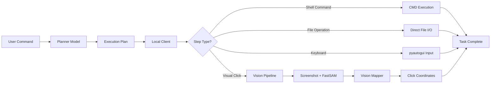
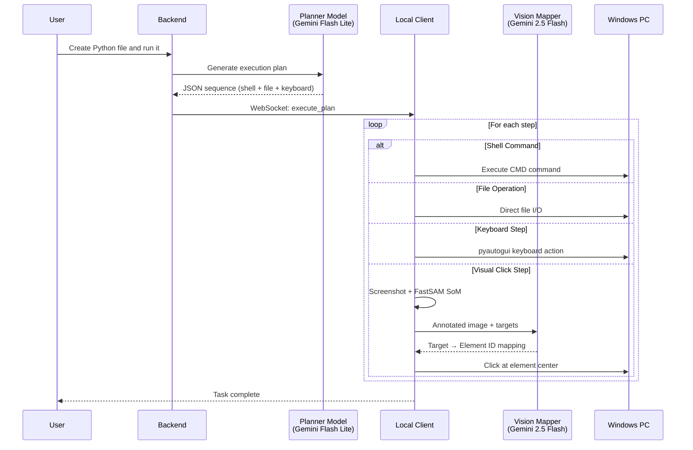
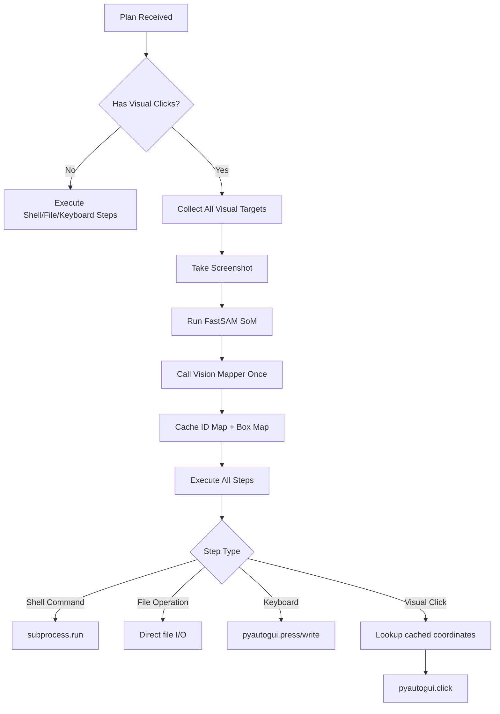
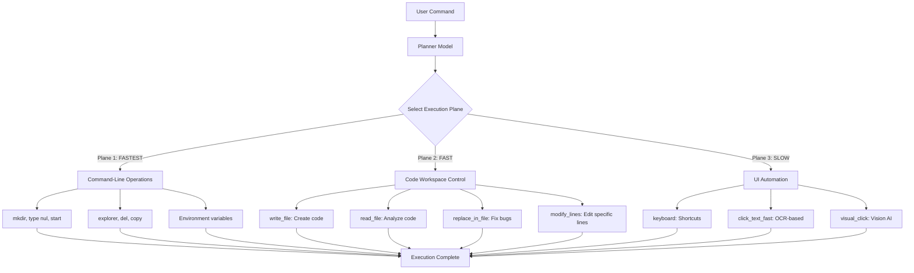
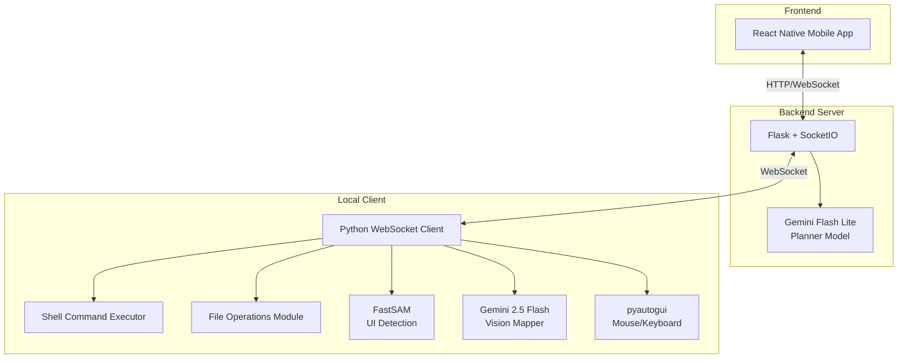
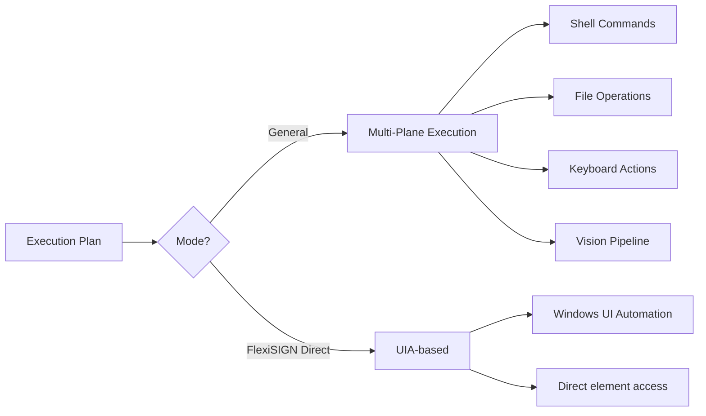
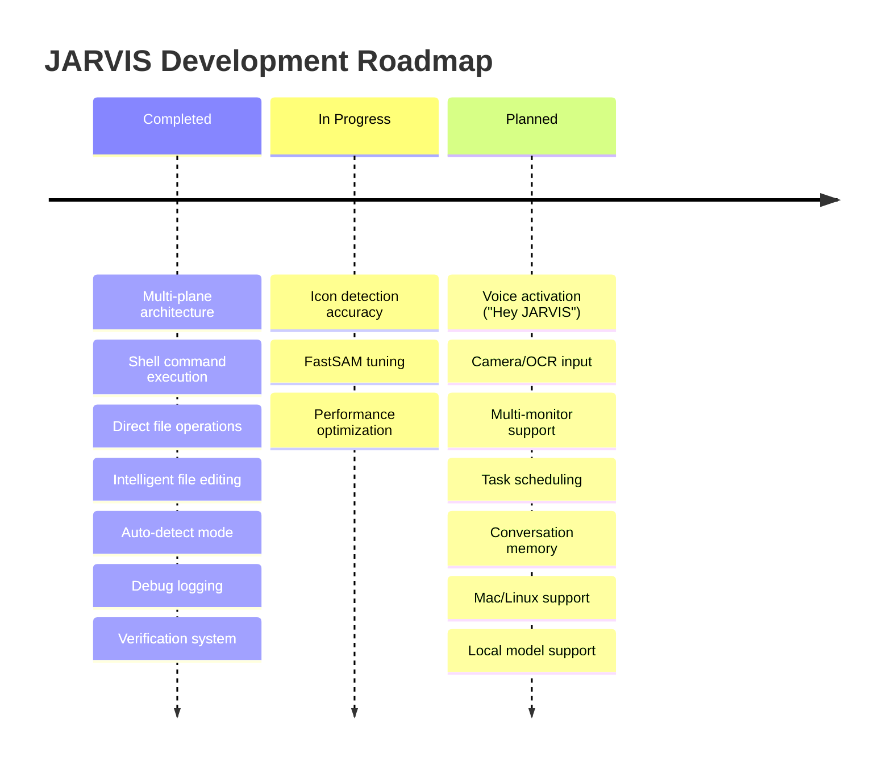

# JARVIS - AI Computer Automation Assistant

## Problem Understanding

Modern computer automation faces a fundamental challenge: bridging the gap between natural language commands and system execution. Traditional automation tools require explicit scripting, making them brittle and inaccessible to non-technical users.

Key challenges addressed:
- **Natural Language Ambiguity**: Users express tasks in varied, informal ways ("create a Python file and run it")
- **Execution Method Selection**: Choosing between command-line, file operations, or GUI interaction
- **Dynamic UI Elements**: Screen layouts change based on resolution, themes, and application state (when GUI needed)
- **Cross-Application Automation**: Different apps require different automation approaches
- **Code Manipulation**: Directly editing files without opening editors

## Solution Approach

JARVIS implements a **Multi-Plane Execution Architecture** that intelligently selects the fastest method for each task:



**Execution Priority (Strict Order):**
1. **Command-Line Operations** (FASTEST) - Shell commands for file/folder operations
2. **Direct File Operations** (FAST) - Read/write files without UI
3. **Keyboard Shortcuts** (MEDIUM) - Deterministic keyboard actions
4. **UI Automation** (SLOW) - Vision-based clicking as last resort

This multi-plane approach allows JARVIS to:
1. **Choose the fastest method** for each operation
2. **Bypass UI when possible** (command-line and file I/O)
3. **Fall back to GUI** when necessary (legacy apps, visual elements)
4. **Manipulate code directly** without opening editors

## Technical Methodology

### Multi-Plane Execution Architecture



### Model 1: Planner (Gemini Flash Lite)

Converts natural language into structured execution plans with intelligent method selection.

**Execution Priority Rules:**
```
1. Command-line operations FIRST (mkdir, type nul, start)
2. Direct filesystem operations SECOND (write_file, read_file)
3. Keyboard shortcuts THIRD (ctrl+s, ctrl+c)
4. UI-based navigation LAST RESORT (visual_click, click_text)
```

**Supported Modes:**

| Mode | Use Case | Knowledge |
|------|----------|-----------|
| General | Any computer task | Shell commands, file ops, UI patterns |
| FlexiSIGN | Design/Professional Task | Plate dimensions, UIA automation |

**Output Format:**
```json
{
  "mode": "general",
  "sequence": [
    {"order": 1, "type": "shell_command", "command": "mkdir \"%USERPROFILE%\\Desktop\\LabCode\"", "desc": "Create folder"},
    {"order": 2, "type": "write_file", "path": "%USERPROFILE%\\Desktop\\LabCode\\script.py", "content": "def hello():\n    print('Hello')", "desc": "Write Python file"},
    {"order": 3, "type": "shell_command", "command": "code \"%USERPROFILE%\\Desktop\\LabCode\"", "desc": "Open VS Code"},
    {"order": 4, "type": "keyboard", "value": "ctrl+`", "desc": "Open terminal"}
  ],
  "expected_final_state": "VS Code showing script.py with terminal open"
}
```

**Supported Step Types (25+):**
- **Shell**: `shell_command`
- **File I/O**: `write_file`, `read_file`, `append_file`, `create_directory`
- **File Editing**: `replace_in_file`, `modify_lines`, `insert_at_line`, `delete_lines`
- **File Operations**: `open_file`, `open_folder`, `save_file`
- **Keyboard**: `keyboard`
- **UI Interaction**: `visual_click`, `click_text_fast`, `click_text`
- **FlexiSIGN**: `create_text`, `set_dimensions`, `set_font`, `apply_style`, `move_object`

### Model 2: Vision Mapper (Gemini 2.5 Flash)

Identifies UI elements in annotated screenshots. Uses Set-of-Mark (SoM) technique:

1. **FastSAM** detects all UI elements and draws numbered red boxes
2. **Vision Mapper** receives the annotated image + target list
3. Returns mapping: `{"address_bar": 45, "submit_button": 12}`

### Single-Pass Vision Architecture (When Needed)

Vision pipeline is used only when command-line and file operations cannot accomplish the task:



### Three Execution Planes



## Tools, Models & Architecture

### Technology Stack



### Component Details

| Component | Technology | Purpose |
|-----------|------------|---------|
| Mobile App | React Native + Expo | User interface for commands |
| Backend Server | Flask + Flask-SocketIO | API gateway, plan generation |
| Planner Model | Gemini 2.5 Flash Lite | NL → Execution plan (multi-plane) |
| Shell Executor | subprocess + CMD | Command-line operations |
| File Operations | Python file I/O | Direct file manipulation |
| File Editor | Custom module | IDE-like editing (replace, modify lines) |
| Vision Mapper | Gemini 2.5 Flash | Image → Element IDs (fallback) |
| SoM Detection | FastSAM (Ultralytics) | UI element segmentation |
| Automation | pyautogui + pywin32 | Mouse/keyboard control |
| Communication | WebSocket | Real-time bidirectional |

### Key Files Structure

```
├── backend/
│   ├── server.py              # Flask API + WebSocket hub
│   ├── planner_service.py     # Planner Model integration (multi-plane)
│   ├── file_operations.py     # Direct file I/O operations
│   ├── file_editor.py         # Intelligent file editing
│   └── SoM.py                 # FastSAM annotation logic
│
├── local_client/
│   ├── client.py              # WebSocket client, command router
│   ├── plan_executor.py       # Multi-plane step execution engine
│   ├── vision_service.py      # Screenshot, SoM, Vision Mapper
│   ├── direct_path_executor.py # File/folder operations
│   ├── text_clicker.py        # OCR-based clicking
│   └── flexisign_uia.py       # FlexiSIGN-specific automation
│
└── ChatInterface/             # React Native mobile app
```

### Execution Modes

The system supports multiple execution strategies:



| Mode | When Used | Execution Strategy |
|------|-----------|-------------------|
| General | Any computer task | Multi-plane (shell → file → keyboard → vision) |
| FlexiSIGN Direct | Number plate creation | UIA automation (no vision) |
| Vision Fallback | Unknown UIs, legacy apps | FastSAM + Gemini Vision |

## Expected Impact

### Immediate Benefits

- **Speed**: Command-line and file operations are 10-50x faster than UI automation
- **Reliability**: Direct file I/O eliminates UI detection failures
- **Developer Productivity**: Write and edit code files without opening editors
- **Flexibility**: Works across any Windows application (with GUI fallback)
- **Debuggability**: Comprehensive logging captures all execution planes
- **Hybrid Workflows**: Seamlessly mix command-line, file ops, and GUI automation

### Use Cases

| Domain | Example Commands |
|--------|------------------|
| Developer Productivity | "Create a Python file with bubble sort and run it in VS Code" |
| Code Manipulation | "Read the code from document.txt and fix the bug on line 15" |
| File Operations | "Create folder 'AI Lab' with 3 text files on Desktop" |
| System Automation | "Open Chrome and go to youtube.com" |
| FlexiSIGN | "Make iron number plate set for bike, PB12W3998" |
| Hybrid Workflows | "Create Python script, open in editor, run in terminal" |

### Performance Characteristics

**Execution Speed by Method:**
- **Shell Command**: ~0.1 seconds (mkdir, type nul, start)
- **File Operation**: ~0.1 seconds (write_file, read_file)
- **Keyboard Action**: ~0.3-0.5 seconds per step
- **OCR Click**: ~1-2 seconds (click_text_fast)
- **Vision Click**: ~3-5 seconds (FastSAM + Vision Mapper)

**Typical Task Times:**
- **Create folder + file**: ~0.5 seconds (shell commands)
- **Write Python file**: ~0.2 seconds (write_file)
- **Launch app**: ~3-5 seconds (with window wait)
- **Vision-based task**: ~10-15 seconds (with screenshot)
- **Hybrid workflow**: ~5-10 seconds (shell + file + keyboard)

**Plan Generation**: ~1-2 seconds (Gemini Flash Lite)

### Future Roadmap



### Debug & Troubleshooting

Each execution creates a debug folder with full traceability:

```
debug_logs/2024-12-01_16-39-33/
├── session_info.json          # Command, timestamps, mode
├── planner_output.json        # Execution plan (all step types)
├── screenshot.png             # Original capture (if vision used)
├── annotated.png              # SoM-marked image (if vision used)
├── box_map.json               # Element coordinates (if vision used)
├── vision_mapper_output.json # Target mappings (if vision used)
├── verification_result.json   # Task completion verification
└── execution_log.txt          # Step-by-step log (all planes)
```

This enables rapid diagnosis of:
- **Planner Issues**: Wrong execution plane selected
- **Shell Command Failures**: Command syntax or path errors
- **File Operation Errors**: Permission issues, path resolution
- **Vision Pipeline Failures**: FastSAM detection, Vision Mapper misidentification
- **Verification Failures**: Expected vs actual state mismatch
