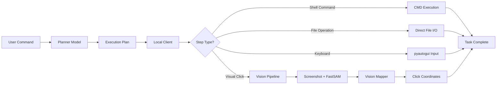
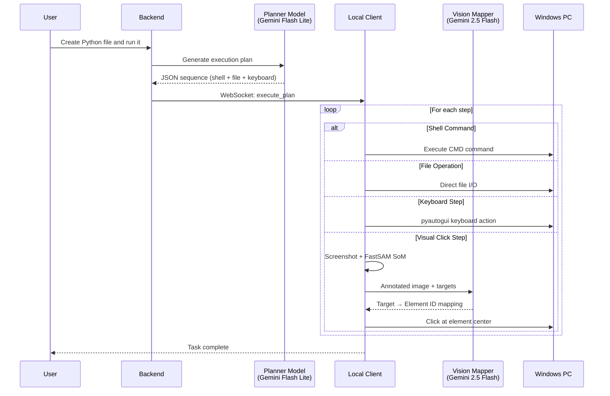
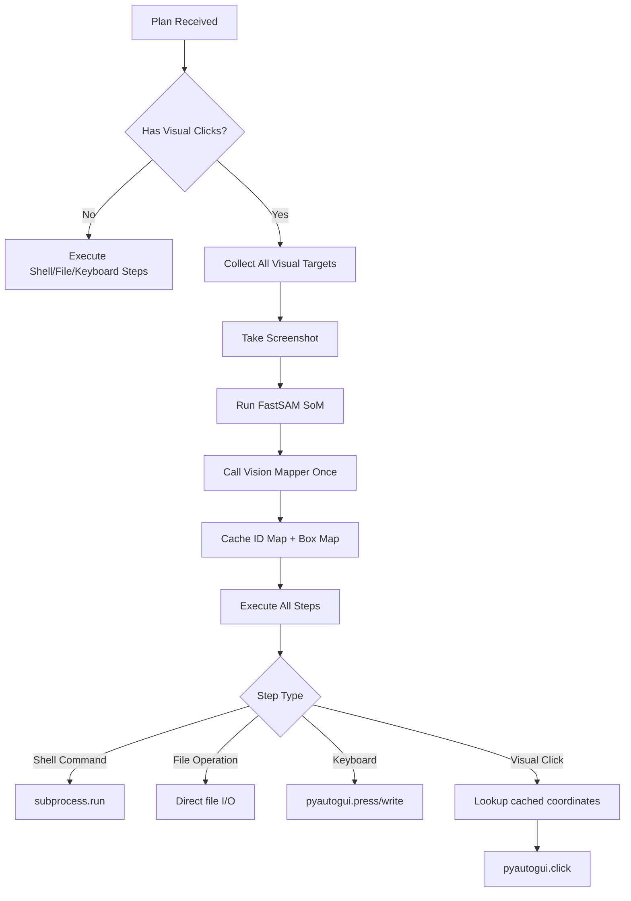
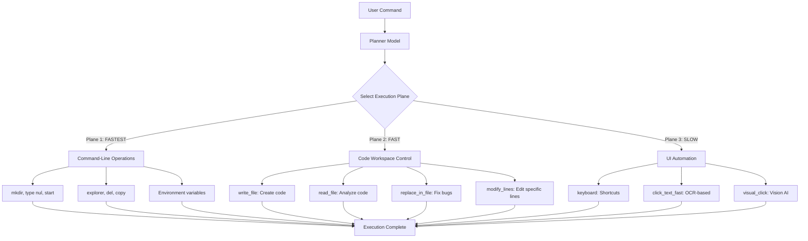
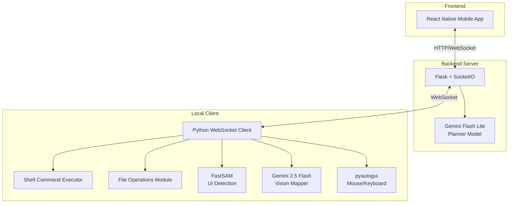
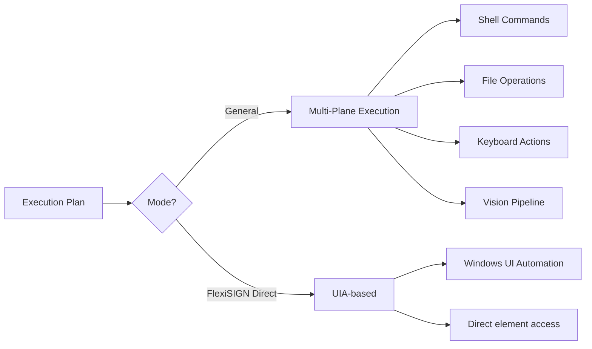
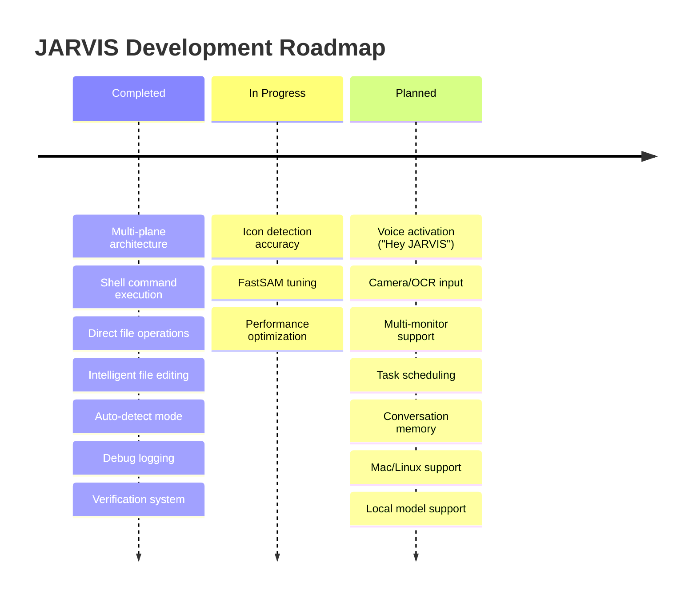

# JARVIS - AI Computer Automation Assistant

## Problem Understanding

Modern computer automation faces a fundamental challenge: bridging the gap between natural language commands and system execution. Traditional automation tools require explicit scripting, making them brittle and inaccessible to non-technical users.

Key challenges addressed:
- **Natural Language Ambiguity**: Users express tasks in varied, informal ways ("create a Python file and run it")
- **Execution Method Selection**: Choosing between command-line, file operations, or GUI interaction
- **Dynamic UI Elements**: Screen layouts change based on resolution, themes, and application state (when GUI needed)
- **Cross-Application Automation**: Different apps require different automation approaches
- **Code Manipulation**: Directly editing files without opening editors

## Solution Approach

JARVIS implements a **Multi-Plane Execution Architecture** that intelligently selects the fastest method for each task:



**Execution Priority (Strict Order):**
1. **Command-Line Operations** (FASTEST) - Shell commands for file/folder operations
2. **Direct File Operations** (FAST) - Read/write files without UI
3. **Keyboard Shortcuts** (MEDIUM) - Deterministic keyboard actions
4. **UI Automation** (SLOW) - Vision-based clicking as last resort

This multi-plane approach allows JARVIS to:
1. **Choose the fastest method** for each operation
2. **Bypass UI when possible** (command-line and file I/O)
3. **Fall back to GUI** when necessary (legacy apps, visual elements)
4. **Manipulate code directly** without opening editors

## Technical Methodology

### Multi-Plane Execution Architecture



### Model 1: Planner (Gemini Flash Lite)

Converts natural language into structured execution plans with intelligent method selection.

**Execution Priority Rules:**
```
1. Command-line operations FIRST (mkdir, type nul, start)
2. Direct filesystem operations SECOND (write_file, read_file)
3. Keyboard shortcuts THIRD (ctrl+s, ctrl+c)
4. UI-based navigation LAST RESORT (visual_click, click_text)
```

**Supported Modes:**

| Mode | Use Case | Knowledge |
|------|----------|-----------|
| General | Any computer task | Shell commands, file ops, UI patterns |
| FlexiSIGN | Design/Professional Task | Plate dimensions, UIA automation |

**Output Format:**
```json
{
  "mode": "general",
  "sequence": [
    {"order": 1, "type": "shell_command", "command": "mkdir \"%USERPROFILE%\\Desktop\\LabCode\"", "desc": "Create folder"},
    {"order": 2, "type": "write_file", "path": "%USERPROFILE%\\Desktop\\LabCode\\script.py", "content": "def hello():\n    print('Hello')", "desc": "Write Python file"},
    {"order": 3, "type": "shell_command", "command": "code \"%USERPROFILE%\\Desktop\\LabCode\"", "desc": "Open VS Code"},
    {"order": 4, "type": "keyboard", "value": "ctrl+`", "desc": "Open terminal"}
  ],
  "expected_final_state": "VS Code showing script.py with terminal open"
}
```

**Supported Step Types (25+):**
- **Shell**: `shell_command`
- **File I/O**: `write_file`, `read_file`, `append_file`, `create_directory`
- **File Editing**: `replace_in_file`, `modify_lines`, `insert_at_line`, `delete_lines`
- **File Operations**: `open_file`, `open_folder`, `save_file`
- **Keyboard**: `keyboard`
- **UI Interaction**: `visual_click`, `click_text_fast`, `click_text`
- **FlexiSIGN**: `create_text`, `set_dimensions`, `set_font`, `apply_style`, `move_object`

### Model 2: Vision Mapper (Gemini 2.5 Flash)

Identifies UI elements in annotated screenshots. Uses Set-of-Mark (SoM) technique:

1. **FastSAM** detects all UI elements and draws numbered red boxes
2. **Vision Mapper** receives the annotated image + target list
3. Returns mapping: `{"address_bar": 45, "submit_button": 12}`

### Single-Pass Vision Architecture (When Needed)

Vision pipeline is used only when command-line and file operations cannot accomplish the task:



### Three Execution Planes



## Tools, Models & Architecture

### Technology Stack



### Component Details

| Component | Technology | Purpose |
|-----------|------------|---------|
| Mobile App | React Native + Expo | User interface for commands |
| Backend Server | Flask + Flask-SocketIO | API gateway, plan generation |
| Planner Model | Gemini 2.5 Flash Lite | NL → Execution plan (multi-plane) |
| Shell Executor | subprocess + CMD | Command-line operations |
| File Operations | Python file I/O | Direct file manipulation |
| File Editor | Custom module | IDE-like editing (replace, modify lines) |
| Vision Mapper | Gemini 2.5 Flash | Image → Element IDs (fallback) |
| SoM Detection | FastSAM (Ultralytics) | UI element segmentation |
| Automation | pyautogui + pywin32 | Mouse/keyboard control |
| Communication | WebSocket | Real-time bidirectional |

### Key Files Structure

```
├── backend/
│   ├── server.py              # Flask API + WebSocket hub
│   ├── planner_service.py     # Planner Model integration (multi-plane)
│   ├── file_operations.py     # Direct file I/O operations
│   ├── file_editor.py         # Intelligent file editing
│   └── SoM.py                 # FastSAM annotation logic
│
├── local_client/
│   ├── client.py              # WebSocket client, command router
│   ├── plan_executor.py       # Multi-plane step execution engine
│   ├── vision_service.py      # Screenshot, SoM, Vision Mapper
│   ├── direct_path_executor.py # File/folder operations
│   ├── text_clicker.py        # OCR-based clicking
│   └── flexisign_uia.py       # FlexiSIGN-specific automation
│
└── ChatInterface/             # React Native mobile app
```

### Execution Modes

The system supports multiple execution strategies:



| Mode | When Used | Execution Strategy |
|------|-----------|-------------------|
| General | Any computer task | Multi-plane (shell → file → keyboard → vision) |
| FlexiSIGN Direct | Number plate creation | UIA automation (no vision) |
| Vision Fallback | Unknown UIs, legacy apps | FastSAM + Gemini Vision |

## Expected Impact

### Immediate Benefits

- **Speed**: Command-line and file operations are 10-50x faster than UI automation
- **Reliability**: Direct file I/O eliminates UI detection failures
- **Developer Productivity**: Write and edit code files without opening editors
- **Flexibility**: Works across any Windows application (with GUI fallback)
- **Debuggability**: Comprehensive logging captures all execution planes
- **Hybrid Workflows**: Seamlessly mix command-line, file ops, and GUI automation

### Use Cases

| Domain | Example Commands |
|--------|------------------|
| Developer Productivity | "Create a Python file with bubble sort and run it in VS Code" |
| Code Manipulation | "Read the code from document.txt and fix the bug on line 15" |
| File Operations | "Create folder 'AI Lab' with 3 text files on Desktop" |
| System Automation | "Open Chrome and go to youtube.com" |
| FlexiSIGN | "Make iron number plate set for bike, PB12W3998" |
| Hybrid Workflows | "Create Python script, open in editor, run in terminal" |

### Performance Characteristics

**Execution Speed by Method:**
- **Shell Command**: ~0.1 seconds (mkdir, type nul, start)
- **File Operation**: ~0.1 seconds (write_file, read_file)
- **Keyboard Action**: ~0.3-0.5 seconds per step
- **OCR Click**: ~1-2 seconds (click_text_fast)
- **Vision Click**: ~3-5 seconds (FastSAM + Vision Mapper)

**Typical Task Times:**
- **Create folder + file**: ~0.5 seconds (shell commands)
- **Write Python file**: ~0.2 seconds (write_file)
- **Launch app**: ~3-5 seconds (with window wait)
- **Vision-based task**: ~10-15 seconds (with screenshot)
- **Hybrid workflow**: ~5-10 seconds (shell + file + keyboard)

**Plan Generation**: ~1-2 seconds (Gemini Flash Lite)

### Future Roadmap



### Debug & Troubleshooting

Each execution creates a debug folder with full traceability:

```
debug_logs/2024-12-01_16-39-33/
├── session_info.json          # Command, timestamps, mode
├── planner_output.json        # Execution plan (all step types)
├── screenshot.png             # Original capture (if vision used)
├── annotated.png              # SoM-marked image (if vision used)
├── box_map.json               # Element coordinates (if vision used)
├── vision_mapper_output.json # Target mappings (if vision used)
├── verification_result.json   # Task completion verification
└── execution_log.txt          # Step-by-step log (all planes)
```

This enables rapid diagnosis of:
- **Planner Issues**: Wrong execution plane selected
- **Shell Command Failures**: Command syntax or path errors
- **File Operation Errors**: Permission issues, path resolution
- **Vision Pipeline Failures**: FastSAM detection, Vision Mapper misidentification
- **Verification Failures**: Expected vs actual state mismatch


---

## Installation & Setup Guide

This guide will walk you through setting up JARVIS from scratch on Windows.

### Prerequisites

Before you begin, ensure you have:
- **Windows 10/11** (64-bit)
- **Python 3.10 or higher** ([Download](https://www.python.org/downloads/))
- **Node.js 18+ and npm** ([Download](https://nodejs.org/))
- **Git** (optional, for cloning) ([Download](https://git-scm.com/))
- **Gemini API Key** ([Get one free](https://aistudio.google.com/app/apikey))
- **Tesseract OCR** (for text-based clicking) ([Download](https://github.com/UB-Mannheim/tesseract/wiki))

### Step 1: Download JARVIS

**Option A: Clone with Git**
```cmd
git clone https://github.com/Bada-Don/Jarvis.git
cd jarvis
```

**Option B: Download ZIP**
1. Download the ZIP file from GitHub
2. Extract to a folder (e.g., `C:\JARVIS`)
3. Open Command Prompt in that folder

### Step 2: Install Tesseract OCR

1. Download Tesseract installer from: https://github.com/UB-Mannheim/tesseract/wiki
2. Run the installer (use default installation path: `C:\Program Files\Tesseract-OCR`)
3. Add Tesseract to your system PATH:
   - Open System Properties → Environment Variables
   - Edit "Path" variable
   - Add: `C:\Program Files\Tesseract-OCR`
4. Verify installation:
   ```cmd
   tesseract --version
   ```

### Step 3: Download FastSAM Weights

FastSAM is used for UI element detection. Download the model weights:

1. Create a `weights` folder in the `backend` directory:
   ```cmd
   mkdir backend\weights
   ```

2. Download FastSAM-s.pt from one of these sources:
   - **Official**: https://github.com/CASIA-IVA-Lab/FastSAM/releases
   - **Direct link**: https://huggingface.co/spaces/An-619/FastSAM/resolve/main/weights/FastSAM-s.pt

3. Place `FastSAM-s.pt` in `backend\weights\`

### Step 4: Set Up Backend Server

#### 4.1 Create Virtual Environment

```cmd
cd backend
python -m venv venv
```

#### 4.2 Activate Virtual Environment

```cmd
venv\Scripts\activate
```

You should see `(venv)` in your command prompt.

#### 4.3 Install Dependencies

```cmd
pip install -r requirements.txt
```

This will install:
- Flask (web server)
- Flask-SocketIO (WebSocket communication)
- Ultralytics (FastSAM)
- OpenCV, Pillow (image processing)
- PyTorch (deep learning)
- PyAutoGUI (automation)
- Pytesseract (OCR)
- Google GenAI (Gemini API)
- OpenAI (alternative LLM)
- And more...

**Note:** PyTorch installation may take 5-10 minutes depending on your internet speed.

#### 4.4 Configure Environment Variables

Create a `.env` file in the `backend` directory:

```cmd
notepad .env
```

Add your API keys:

```env
# Gemini API Key (required)
GEMINI_API_KEY=your_gemini_api_key_here

# OpenAI API Key (optional, if using OpenAI instead of Gemini)
OPENAI_API_KEY=your_openai_api_key_here
```

Save and close the file.

**Get API Keys:**
- **Gemini**: https://aistudio.google.com/app/apikey (Free tier available)
- **OpenAI**: https://platform.openai.com/api-keys (Paid, requires credit card)

### Step 5: Set Up Local Client

#### 5.1 Create Virtual Environment

Open a **new** Command Prompt window:

```cmd
cd local_client
python -m venv venv
```

#### 5.2 Activate Virtual Environment

```cmd
venv\Scripts\activate
```

#### 5.3 Install Dependencies

The local client uses the same dependencies as the backend:

```cmd
pip install -r ..\backend\requirements.txt
```

**Additional dependencies for local client:**
```cmd
pip install pywin32 comtypes
```

#### 5.4 Configure Local Client

**Option A: Use Settings UI (Recommended)**

The Settings UI provides a graphical interface to configure JARVIS without editing code.

1. **Build the Settings UI** (first time only):
   ```cmd
   cd ..\settings_ui
   npm install
   npm run build
   ```

2. **Install PyWebView** (if not already installed):
   ```cmd
   cd ..\local_client
   pip install pywebview
   ```

3. **Launch the Settings UI**:
   ```cmd
   python run_settings.py
   ```

   This will open a desktop application window with the settings interface.

4. **Configure the following settings:**
   - **Server URL**: `http://localhost:5000` (default)
   - **LLM Provider**: Choose `gemini` or `openai`
   - **Windows Username**: Your Windows username (e.g., `harsh`)
   - **Desktop Path**: Your Desktop path (e.g., `C:\Users\harsh\OneDrive\Desktop`)
   - **Documents Path**: Your Documents path (e.g., `C:\Users\harsh\Documents`)
   - **Downloads Path**: Your Downloads path (e.g., `C:\Users\harsh\Downloads`)
   - **Stickers Path**: Custom folder path (if applicable)
   - **Timing Settings**: Leave defaults unless you experience issues
   - **Verification Settings**: Enable for production, disable for testing

5. **Click "Save Configuration"**

   The settings will be saved to `local_client/config.py`.

**Note:** The web version at `http://localhost:5173` (via `npm run dev`) uses mock data and won't save your configuration. Always use `python run_settings.py` to save settings permanently.

**Development Mode (Optional):**
If you're developing the settings UI and want hot reload:
1. Start the Vite dev server: `cd settings_ui && npm run dev`
2. Launch settings UI in dev mode: `cd ..\local_client && python run_settings.py --dev`
3. Changes to the UI will reload automatically

**Check Dependencies:**
To verify all dependencies are installed:
```cmd
python run_settings.py --check
```

**Option B: Manual Configuration**

Edit `local_client/config.py` directly:

```cmd
cd ..\local_client
notepad config.py
```

Update these critical settings:

```python
# Server connection
SERVER_URL = r"http://localhost:5000"

# LLM provider ('gemini' or 'openai')
LLM_PROVIDER = 'gemini'

# Your Windows username
WINDOWS_USERNAME = 'YourUsername'

# Your paths (use your actual paths)
DESKTOP_PATH = r"C:\Users\YourUsername\Desktop"
DOCUMENTS_PATH = r"C:\Users\YourUsername\Documents"
DOWNLOADS_PATH = r"C:\Users\YourUsername\Downloads"
```

**Finding Your Paths:**
- Open File Explorer
- Navigate to Desktop, Documents, Downloads
- Copy the path from the address bar
- Paste into config.py (use raw strings with `r"..."`)

### Step 6: Set Up Mobile App (React Native)

#### 6.1 Install Dependencies

Open a **new** Command Prompt window:

```cmd
cd ChatInterface
npm install
```

This will install:
- Expo (React Native framework)
- Socket.IO client (WebSocket communication)
- React Native components
- And more...

#### 6.2 Configure Backend URL

Edit `ChatInterface/src/config.js` (or wherever the backend URL is configured):

```javascript
export const BACKEND_URL = 'http://YOUR_PC_IP:5000';
```

**Finding Your PC IP:**
```cmd
ipconfig
```

Look for "IPv4 Address" under your active network adapter (e.g., `192.168.1.100`).

**Important:** Use your PC's local IP address, not `localhost`, so the mobile app can connect.

### Step 7: Start JARVIS

Now that everything is configured, start all three components in order:

#### 7.1 Start Backend Server

Open Command Prompt #1:

```cmd
cd backend
venv\Scripts\activate
python server.py
```

You should see:
```
==================================================
🤖 JARVIS Backend Server Starting...
==================================================
✓ Gemini Planner Service initialized successfully
 * Running on http://0.0.0.0:5000
```

**Keep this window open.**

#### 7.2 Start Local Client

Open Command Prompt #2:

```cmd
cd local_client
venv\Scripts\activate
python client.py
```

You should see:
```
==================================================
🤖 JARVIS Local Client Starting...
==================================================
Server URL: http://localhost:5000
FlexiSign Manager: ✅
Two-Model Pipeline: ✅
Debug Logger: ✅
Permission Service: ✅
==================================================
✅ Connected to JARVIS Server
```

**Keep this window open.**

#### 7.3 Start Mobile App

Open Command Prompt #3:

```cmd
cd ChatInterface
npx expo start
```

This will start the Expo development server. You'll see a QR code.

**Option A: Run on Physical Device**
1. Install "Expo Go" app on your Android/iOS device
2. Scan the QR code with Expo Go
3. The app will load on your device

**Option B: Run on Emulator**
1. Press `a` for Android emulator (requires Android Studio)
2. Press `i` for iOS simulator (requires Xcode, macOS only)

**Option C: Run in Web Browser**
1. Press `w` to open in web browser
2. Note: Some features may not work in web mode

### Step 8: Test JARVIS

Once all three components are running:

1. Open the mobile app
2. Type a simple command: **"Open Notepad"**
3. Press Send

You should see:
- Backend Server: Receives command, generates plan
- Local Client: Executes plan, opens Notepad
- Mobile App: Shows progress updates

**More Test Commands:**
- "Create a folder called Test on Desktop"
- "Open Chrome and go to google.com"
- "Create a Python file with hello world"

### Troubleshooting

#### Backend Server Issues

**Error: "Gemini API key not configured"**
- Solution: Add `GEMINI_API_KEY` to `backend/.env`

**Error: "FastSAM weights not found"**
- Solution: Download `FastSAM-s.pt` and place in `backend/weights/`

**Error: "Port 5000 already in use"**
- Solution: Change port in `backend/server.py` and `local_client/config.py`

#### Local Client Issues

**Error: "Connection refused"**
- Solution: Ensure backend server is running first
- Check `SERVER_URL` in `local_client/config.py`

**Error: "Tesseract not found"**
- Solution: Install Tesseract OCR and add to PATH
- Verify with: `tesseract --version`

**Error: "pywin32 not installed"**
- Solution: `pip install pywin32 comtypes`

**Error: "Settings UI won't open"**
- Solution: Ensure frontend is built: `cd settings_ui && npm run build`
- Check dependencies: `python run_settings.py --check`
- Install PyWebView: `pip install pywebview`

**Error: "Settings not saving"**
- Solution: Don't use the web version (`npm run dev`)
- Use the desktop app: `python run_settings.py`
- Check file permissions on `config.py`

#### Mobile App Issues

**Error: "Cannot connect to backend"**
- Solution: Use your PC's IP address, not `localhost`
- Ensure firewall allows connections on port 5000
- Ensure PC and phone are on the same network

**Error: "Expo Go not loading"**
- Solution: Clear Expo cache: `npm start -- --clear`

#### Vision Pipeline Issues

**Error: "FastSAM detection failed"**
- Solution: Ensure `FastSAM-s.pt` is in `backend/weights/`
- Check GPU/CUDA availability (CPU fallback is slower)

**Error: "Vision Mapper timeout"**
- Solution: Check internet connection (Gemini API requires internet)
- Increase timeout in `vision_service.py`

### Advanced Configuration

#### Enable Verification System

Edit `local_client/config.py`:

```python
VERIFICATION_ENABLED = True
MAX_RETRIES = 2
CONFIDENCE_THRESHOLD = 0.7
```

This enables automatic verification of task completion with retry on failure.

#### Adjust Timing Settings

If automation is too fast or too slow:

```python
ACTION_DELAY = 0.5          # Increase for slower systems
APP_LAUNCH_WAIT = 5         # Increase for slow app launches
WINDOW_ACTIVATION_TIMEOUT = 15  # Increase if windows take long to appear
```

#### Use OpenAI Instead of Gemini

1. Add OpenAI API key to `backend/.env`:
   ```env
   OPENAI_API_KEY=your_openai_key_here
   ```

2. Edit `local_client/config.py`:
   ```python
   LLM_PROVIDER = 'openai'
   ```

3. Restart backend and local client

#### Enable Debug Logging

Debug logs are enabled by default. Find them in:
```
debug_logs/YYYY-MM-DD_HH-MM-SS/
```

Each session contains:
- `session_info.json` - Command and metadata
- `planner_output.json` - Generated execution plan
- `screenshot.png` - Original screenshot (if vision used)
- `annotated.png` - Annotated screenshot (if vision used)
- `box_map.json` - UI element coordinates
- `vision_mapper_output.json` - Target mappings
- `verification_result.json` - Verification results
- `execution_log.txt` - Step-by-step execution log

### Running JARVIS on Startup (Optional)

To start JARVIS automatically when Windows boots:

#### Create Startup Scripts

**1. Create `start_backend.bat`:**
```batch
@echo off
cd /d C:\JARVIS\backend
call venv\Scripts\activate
python server.py
pause
```

**2. Create `start_client.bat`:**
```batch
@echo off
cd /d C:\JARVIS\local_client
call venv\Scripts\activate
python client.py
pause
```

#### Add to Windows Startup

1. Press `Win + R`
2. Type `shell:startup` and press Enter
3. Create shortcuts to `start_backend.bat` and `start_client.bat`
4. Place shortcuts in the Startup folder

Now JARVIS will start automatically when you log in to Windows.

### Updating JARVIS

To update to the latest version:

```cmd
git pull origin main
cd backend
venv\Scripts\activate
pip install -r requirements.txt --upgrade
cd ..\local_client
venv\Scripts\activate
pip install -r ..\backend\requirements.txt --upgrade
cd ..\ChatInterface
npm install
```

### Uninstalling JARVIS

To completely remove JARVIS:

1. Delete the JARVIS folder
2. Remove startup scripts from `shell:startup`
3. (Optional) Uninstall Python packages:
   ```cmd
   pip uninstall -r backend\requirements.txt -y
   ```

### Getting Help

If you encounter issues:

1. **Check Debug Logs**: `debug_logs/` folder contains detailed execution logs
2. **GitHub Issues**: https://github.com/yourusername/jarvis/issues
3. **Discord Community**: [Join our Discord](#) (coming soon)
4. **Documentation**: https://jarvis-docs.com (coming soon)

### Next Steps

Now that JARVIS is running:

1. **Explore Commands**: Try different automation tasks
2. **Read Documentation**: Learn about advanced features
3. **Customize Prompts**: Modify `planner_service.py` for your use cases
4. **Contribute**: Submit bug reports, feature requests, or pull requests
5. **Share**: Tell others about JARVIS!

---

## License

This project is licensed under the GNU General Public License v3.0 - see the [LICENSE](LICENSE) file for details.

JARVIS is free software: you can redistribute it and/or modify it under the terms of the GNU General Public License as published by the Free Software Foundation, either version 3 of the License, or (at your option) any later version.

## Contributing

Contributions are welcome! Please read [CONTRIBUTING.md](CONTRIBUTING.md) for guidelines.

## Acknowledgments

- **FastSAM**: UI element detection
- **Google Gemini**: Natural language understanding and vision mapping
- **Ultralytics**: YOLO and FastSAM implementation
- **PyAutoGUI**: Cross-platform GUI automation
- **Flask-SocketIO**: Real-time communication
- **React Native**: Mobile app framework

---

**Built with ❤️ by [Your Name]**
