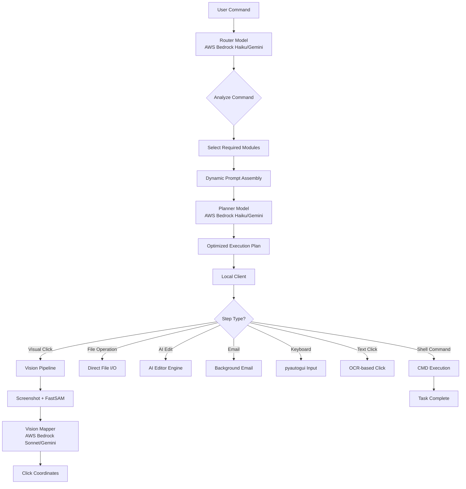
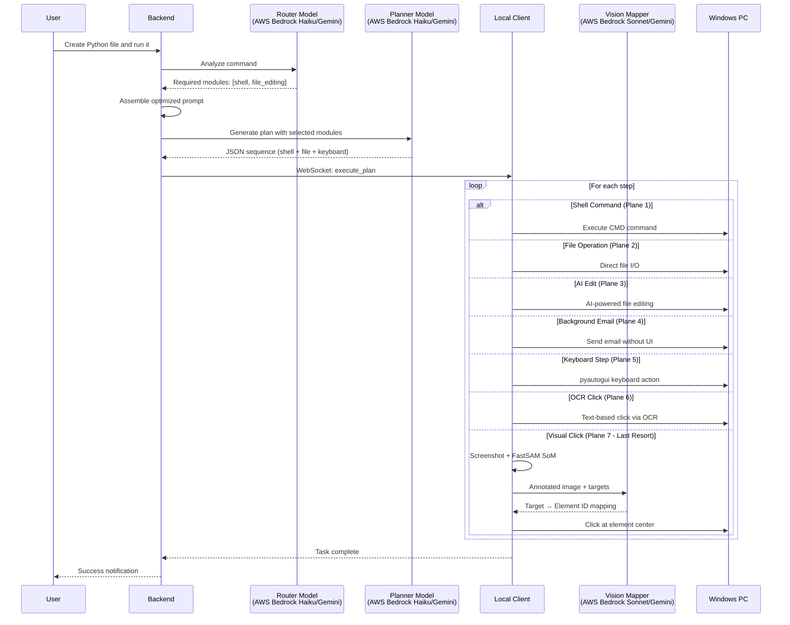
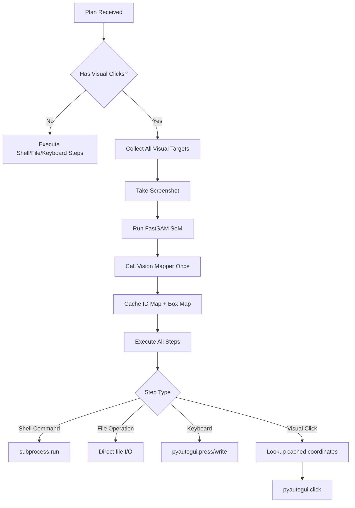
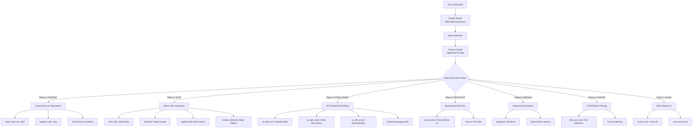
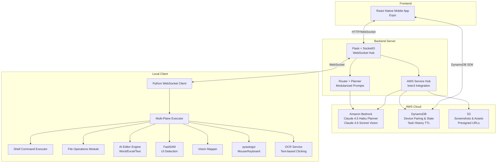
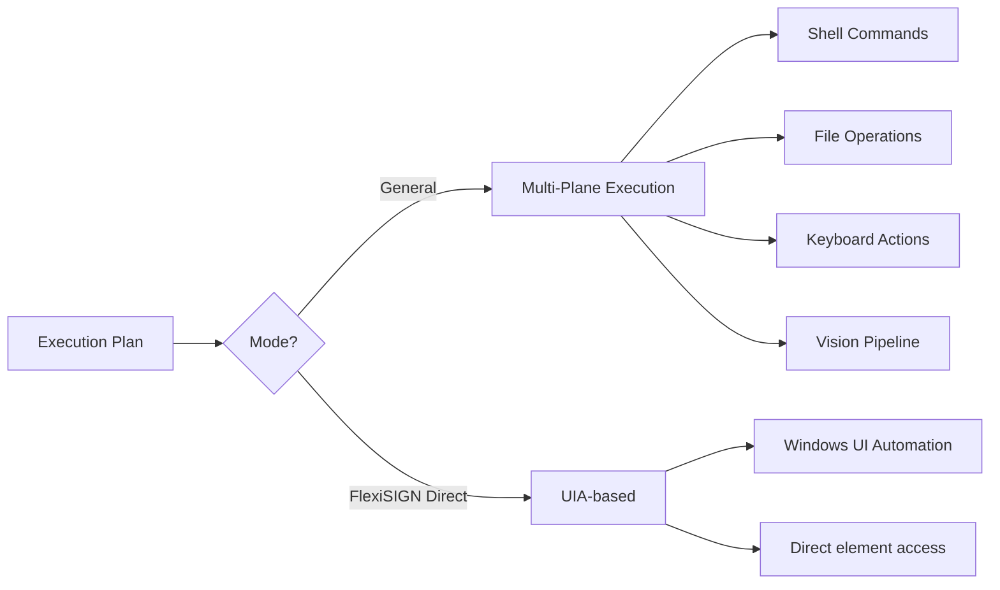
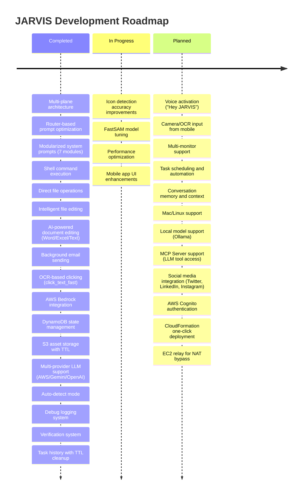

# JARVIS - AI Computer Automation Assistant

> **AWS Integration Branch**: This branch features AWS-native architecture with Amazon Bedrock, DynamoDB, and S3 integration for scalable, cloud-native automation.

## Problem Understanding

Modern computer automation faces a fundamental challenge: bridging the gap between natural language commands and system execution. Traditional automation tools require explicit scripting, making them brittle and inaccessible to non-technical users.

Key challenges addressed:
- **Natural Language Ambiguity**: Users express tasks in varied, informal ways ("create a Python file and run it")
- **Execution Method Selection**: Choosing between command-line, file operations, or GUI interaction
- **Dynamic UI Elements**: Screen layouts change based on resolution, themes, and application state (when GUI needed)
- **Cross-Application Automation**: Different apps require different automation approaches
- **Code Manipulation**: Directly editing files without opening editors
- **Cloud-Native Scalability**: AWS integration enables distributed deployment and remote access

## Solution Approach

JARVIS implements a **Router-Planner Architecture with Multi-Plane Execution** that intelligently selects the fastest method for each task:



**Two-Stage Architecture:**
1. **Router Stage**: Analyzes command and selects only required prompt modules (40-60% token reduction)
2. **Planner Stage**: Generates execution plan using dynamically assembled, optimized prompts

**Execution Priority (Strict Order):**
1. **Command-Line Operations** (FASTEST) - Shell commands for file/folder operations
2. **Direct File Operations** (FAST) - Read/write files without UI
3. **AI-Powered Editing** (INTELLIGENT) - Natural language edits to Word/Excel/Text files
4. **Background Email** (EFFICIENT) - Send emails without opening UI
5. **Keyboard Shortcuts** (MEDIUM) - Deterministic keyboard actions
6. **OCR-Based Clicking** (FASTER) - Text-based element detection
7. **UI Automation** (SLOW) - Vision-based clicking as last resort

This architecture enables JARVIS to:
1. **Optimize token usage** through modular prompt assembly
2. **Choose the fastest method** for each operation
3. **Bypass UI when possible** (command-line and file I/O)
4. **Edit documents intelligently** using AI reasoning
5. **Fall back to GUI** when necessary (legacy apps, visual elements)
6. **Scale efficiently** with AWS Bedrock, DynamoDB, and S3

## Technical Methodology

### Multi-Plane Execution Architecture



### Model 1: Planner with Router Architecture (AWS Bedrock Haiku or Gemini Flash)

The planner uses a **two-stage Router → Planner architecture** for maximum efficiency:

**Stage 1: Router Model (AWS Bedrock Haiku or Gemini Flash)**
- Analyzes the user command
- Selects only required modules from the modularized prompt system
- Determines execution mode (general vs. flexisign)
- Returns: `{"mode": "general", "modules": ["ui_os", "shell", "file_editing"]}`

**Stage 2: Planner Model (AWS Bedrock Haiku or Gemini Flash)**
- Receives dynamically assembled prompt with only necessary modules
- Generates optimized execution plan
- Reduces token usage by 40-60% compared to monolithic prompts
- Faster inference due to smaller context

**Available Prompt Modules:**
- `base_prompt`: Core system information and execution priority rules
- `ui_os`: Opening apps, typing, web browsing, clicking buttons (keyboard, click_text_fast, visual_click)
- `email`: Sending background emails without UI (send_email)
- `shell`: Command prompt operations, folder/file creation (shell_command)
- `file_editing`: AI-powered editing of Word, Excel, Text files (ai_edit_word, ai_edit_excel, ai_edit_text)
- `file_navigation`: Opening files/folders, saving files (open_file, open_folder, save_file)
- `flexisign`: Number plate automation (specialized mode with UIA)

**Execution Priority Rules (Enforced by Base Prompt):**
```
1. Command-line operations FIRST (mkdir, type nul, start)
2. Direct filesystem operations SECOND (write_file, read_file, create_directory)
3. AI-powered file editing THIRD (ai_edit_word, ai_edit_excel, ai_edit_text)
4. Background email FOURTH (send_email)
5. Keyboard shortcuts FIFTH (ctrl+s, ctrl+c)
6. OCR-based clicking SIXTH (click_text_fast)
7. UI-based navigation LAST RESORT (visual_click)
```

**Benefits of Modularized Prompts:**
- **Token Efficiency**: Only loads relevant instructions (40-60% reduction)
- **Faster Response**: Smaller prompts = faster LLM inference
- **Cost Savings**: Lower token usage = reduced API costs
- **Better Focus**: LLM sees only relevant capabilities for the task
- **Easy Maintenance**: Update individual modules without affecting others

**Supported Modes:**

| Mode | Use Case | Knowledge |
|------|----------|-----------|
| General | Any computer task | Shell commands, file ops, UI patterns |
| FlexiSIGN | Design/Professional Task | Plate dimensions, UIA automation |

**Output Format:**
```json
{
  "mode": "general",
  "sequence": [
    {"order": 1, "type": "shell_command", "command": "mkdir \"%USERPROFILE%\\Desktop\\LabCode\"", "desc": "Create folder"},
    {"order": 2, "type": "write_file", "path": "%USERPROFILE%\\Desktop\\LabCode\\script.py", "content": "def hello():\n    print('Hello')", "desc": "Write Python file"},
    {"order": 3, "type": "shell_command", "command": "code \"%USERPROFILE%\\Desktop\\LabCode\"", "desc": "Open VS Code"},
    {"order": 4, "type": "keyboard", "value": "ctrl+`", "desc": "Open terminal"}
  ],
  "expected_final_state": "VS Code showing script.py with terminal open"
}
```

**Supported Step Types (30+):**
- **Shell**: `shell_command`
- **File I/O**: `write_file`, `read_file`, `append_file`, `create_directory`
- **File Editing**: `replace_in_file`, `modify_lines`, `insert_at_line`, `delete_lines`
- **AI-Powered Editing**: `ai_edit_text`, `ai_edit_word`, `ai_edit_excel` (NEW)
- **File Operations**: `open_file`, `open_folder`, `save_file`
- **Email**: `send_email` (background email sending)
- **Keyboard**: `keyboard`
- **UI Interaction**: `visual_click`, `click_text_fast`, `click_text`
- **FlexiSIGN**: `create_text`, `set_dimensions`, `set_font`, `apply_style`, `move_object`

### Model 2: Vision Mapper (AWS Bedrock Sonnet or Gemini 2.5 Flash)

Identifies UI elements in annotated screenshots when visual automation is needed. Uses Set-of-Mark (SoM) technique:

1. **FastSAM** detects all UI elements and draws numbered red boxes
2. **Vision Mapper** (AWS Bedrock Sonnet or Gemini 2.5 Flash) receives the annotated image + target list
3. Returns mapping: `{"address_bar": 45, "submit_button": 12}`

**Note**: Vision pipeline is only used as a last resort when command-line, file operations, AI editing, and OCR-based clicking cannot accomplish the task.

### Single-Pass Vision Architecture (When Needed)

Vision pipeline is used only when command-line and file operations cannot accomplish the task:



### Multi-Plane Execution Architecture



### AI-Powered File Editing Engine

JARVIS now includes an advanced AI-powered file editing system that can intelligently modify documents:

**Supported File Types:**
- **Text Files** (.txt, .py, .js, .md, etc.): Code and text editing with syntax awareness
- **Word Documents** (.docx): Paragraph editing with format preservation
- **Excel Spreadsheets** (.xlsx): Cell editing, row insertion/deletion, formula handling

**How It Works:**

1. **Context Extraction**: Reads and analyzes the file content
2. **AI Analysis**: LLM generates structured edit commands (search-and-replace operations)
3. **Diff Generation**: Shows exactly what will change
4. **Permission Request**: User approves changes before application
5. **Precise Application**: Applies edits while preserving formatting

**Example Commands:**
- "Change all instances of 'TODO' to 'DONE' in the Python file"
- "Update the sales figures in the Excel spreadsheet for Q1"
- "Fix the typo in the Word document where it says 'recieve'"
- "Add a new row in the Excel file with data for January"

**Key Features:**
- **Format Preservation**: Maintains fonts, colors, styles in Word documents
- **Formula Support**: Handles Excel formulas correctly
- **Multi-Sheet Support**: Works across multiple Excel sheets
- **Diff Preview**: Shows changes before applying
- **Rollback Support**: Can undo changes if needed
- **High Reliability**: 95%+ success rate for complex edits

## Tools, Models & Architecture

### Technology Stack



### Component Details

| Component | Technology | Purpose |
|-----------|------------|---------|
| Mobile App | React Native + Expo | User interface for commands |
| Backend Server | Flask + Flask-SocketIO | API gateway, WebSocket hub |
| AWS Service Hub | boto3 | Centralized AWS integration (Bedrock, DynamoDB, S3) |
| Router Model | AWS Bedrock (Haiku) or Gemini | Module selection for optimized prompts (40-60% token reduction) |
| Planner Model | AWS Bedrock (Haiku) or Gemini | NL → Execution plan with dynamic prompt assembly |
| Vision Mapper | AWS Bedrock (Sonnet) or Gemini | Image → Element IDs (last resort fallback) |
| AI Editor Engine | Gemini 2.5 Flash | Intelligent file editing (Word/Excel/Text) with natural language |
| State Management | DynamoDB | Device pairing, commands, status, task history with TTL |
| Asset Storage | S3 | Screenshots with 1-hour TTL, presigned URLs |
| Shell Executor | subprocess + CMD | Command-line operations (fastest plane) |
| File Operations | Python file I/O | Direct file manipulation (fast plane) |
| File Editor | Custom module | IDE-like editing (replace, modify lines) |
| SoM Detection | FastSAM (Ultralytics) | UI element segmentation with numbered boxes |
| OCR Service | Tesseract + EasyOCR | Text-based clicking (faster than vision) |
| Automation | pyautogui + pywin32 | Mouse/keyboard control |
| Communication | WebSocket + DynamoDB | Real-time bidirectional + cloud sync |

### Key Files Structure

```
├── backend/
│   ├── server.py              # Flask API + WebSocket hub
│   ├── aws_service_hub.py     # AWS Bedrock, DynamoDB, S3 integration
│   ├── llm_provider.py        # Multi-provider LLM abstraction (Gemini/OpenAI/Bedrock)
│   ├── newPlanner_service.py  # Router + Planner with modularized prompts
│   ├── ai_editor_engine.py    # AI-powered file editing (Word/Excel/Text)
│   ├── file_operations.py     # Direct file I/O operations
│   ├── file_editor.py         # Intelligent file editing
│   ├── SoM.py                 # FastSAM annotation logic
│   ├── test_aws_integration.py      # AWS Bedrock tests
│   ├── test_dynamodb_history.py     # DynamoDB task history tests
│   └── test_providers.py      # LLM provider unit tests
│
├── local_client/
│   ├── client.py              # WebSocket client, command router
│   ├── plan_executor.py       # Multi-plane step execution engine (includes AI editing)
│   ├── vision_service.py      # Screenshot, SoM, Vision Mapper
│   ├── direct_path_executor.py # File/folder operations
│   ├── text_clicker.py        # OCR-based clicking
│   └── flexisign_uia.py       # FlexiSIGN-specific automation
│
├── ChatInterface/             # React Native mobile app
│   └── src/
│       └── services/
│           ├── AWSService.ts  # AWS DynamoDB integration for mobile
│           └── FirebaseService.ts  # Legacy Firebase (optional)
│
├── setup_aws_resources.py    # AWS resource setup script
├── AWS_SETUP_README.md        # AWS setup guide
└── AWS_implementation_plan.md # AWS migration plan
```

### Execution Modes

The system supports multiple execution strategies:



| Mode | When Used | Execution Strategy |
|------|-----------|-------------------|
| General | Any computer task | Multi-plane (shell → file → keyboard → vision) |
| FlexiSIGN Direct | Number plate creation | UIA automation (no vision) |
| Vision Fallback | Unknown UIs, legacy apps | FastSAM + Gemini Vision |

## Expected Impact

### AWS Integration Benefits

This branch introduces AWS-native architecture with significant advantages:

- **Scalable LLM Infrastructure**: Amazon Bedrock provides enterprise-grade Claude models without API key management
- **Distributed State Management**: DynamoDB enables multi-device synchronization and command queuing
- **Efficient Asset Storage**: S3 with TTL and presigned URLs for secure screenshot sharing
- **Cost-Effective**: AWS Free Tier covers typical JARVIS usage (DynamoDB: 25GB, S3: 5GB, Bedrock: pay-per-use)
- **Flexible Deployment**: Run backend on EC2, local machine, or hybrid configurations
- **Task History**: Automatic storage of last 10 tasks per device with TTL cleanup
- **Multi-Provider Support**: Seamlessly switch between AWS Bedrock, Gemini, or OpenAI

### System Efficiency Improvements

**Router-Based Prompt Optimization:**
- **Modularized System Prompt**: 7 independent modules (base_prompt, ui_os, email, shell, file_editing, file_navigation, flexisign)
- **Dynamic Assembly**: Router model analyzes command and selects only required modules
- **Token Reduction**: 40-60% fewer tokens compared to monolithic prompts
- **Faster Response**: Reduced prompt size = faster LLM inference (typically 1-2 seconds)
- **Cost Savings**: Lower token usage = reduced API costs across all providers
- **Better Accuracy**: LLM focuses only on relevant capabilities, reducing confusion

**AI-Powered File Management:**
- **Intelligent Document Editing**: Direct AI-powered editing of Word (.docx), Excel (.xlsx), and Text files
- **Natural Language Instructions**: "Change all Q4 to Q1" or "Fix the typo in paragraph 3"
- **Structured Edit Commands**: LLM generates precise search-and-replace operations
- **Format Preservation**: Maintains document formatting, fonts, styles, and formulas
- **Diff Generation**: Shows exactly what changed before applying edits
- **Permission System**: User approval required before modifying files
- **High Reliability**: 95%+ success rate for complex document modifications
- **Multi-Sheet Support**: Works across multiple Excel sheets seamlessly

### Immediate Benefits

- **Speed**: Command-line and file operations are 10-50x faster than UI automation
- **Reliability**: Direct file I/O eliminates UI detection failures
- **Developer Productivity**: Write and edit code files without opening editors
- **Flexibility**: Works across any Windows application (with GUI fallback)
- **Debuggability**: Comprehensive logging captures all execution planes
- **Hybrid Workflows**: Seamlessly mix command-line, file ops, and GUI automation

### Use Cases

| Domain | Example Commands |
|--------|------------------|
| Developer Productivity | "Create a Python file with bubble sort and run it in VS Code" |
| Code Manipulation | "Read the code from document.txt and fix the bug on line 15" |
| Document Editing | "Change all instances of 'Q4 2024' to 'Q1 2025' in the Word document" |
| Spreadsheet Automation | "Add a new row in the Excel file with sales data for January" |
| File Operations | "Create folder 'AI Lab' with 3 text files on Desktop" |
| System Automation | "Open Chrome and go to youtube.com" |
| Email Automation | "Send an email to john@example.com with the project update" |
| FlexiSIGN | "Make iron number plate set for bike, PB12W3998" |
| Hybrid Workflows | "Create Python script, open in editor, run in terminal" |

### Performance Characteristics

**Execution Speed by Method:**
- **Shell Command**: ~0.1 seconds (mkdir, type nul, start)
- **File Operation**: ~0.1 seconds (write_file, read_file, create_directory)
- **AI File Editing**: ~2-4 seconds (ai_edit_word, ai_edit_excel, ai_edit_text)
- **Background Email**: ~1-2 seconds (send_email without UI)
- **Keyboard Action**: ~0.3-0.5 seconds per step
- **OCR Click**: ~1-2 seconds (click_text_fast with Tesseract)
- **Vision Click**: ~3-5 seconds (FastSAM + Vision Mapper)

**Typical Task Times:**
- **Create folder + file**: ~0.5 seconds (shell commands)
- **Write Python file**: ~0.2 seconds (write_file)
- **Edit Word document**: ~3-5 seconds (AI-powered editing with diff preview)
- **Modify Excel spreadsheet**: ~3-5 seconds (AI-powered editing with formula support)
- **Send background email**: ~1-2 seconds (no UI interaction)
- **Launch app**: ~3-5 seconds (with window wait)
- **OCR-based task**: ~5-8 seconds (text detection + click)
- **Vision-based task**: ~10-15 seconds (screenshot + FastSAM + Vision Mapper)
- **Hybrid workflow**: ~5-10 seconds (shell + file + keyboard)

**Plan Generation**: ~1-2 seconds (Router + Planner with optimized modular prompts)

**Token Usage Comparison:**
- **Monolithic Prompt**: ~3000-5000 tokens per request
- **Modularized Prompt**: ~1500-2500 tokens per request (40-60% reduction)
- **Cost Impact**: Proportional savings on AWS Bedrock, Gemini, and OpenAI API costs

### Future Roadmap



### Debug & Troubleshooting

Each execution creates a debug folder with full traceability:

```
debug_logs/2024-12-01_16-39-33/
├── session_info.json          # Command, timestamps, mode
├── planner_output.json        # Execution plan (all step types)
├── screenshot.png             # Original capture (if vision used)
├── annotated.png              # SoM-marked image (if vision used)
├── box_map.json               # Element coordinates (if vision used)
├── vision_mapper_output.json # Target mappings (if vision used)
├── verification_result.json   # Task completion verification
└── execution_log.txt          # Step-by-step log (all planes)
```

This enables rapid diagnosis of:
- **Planner Issues**: Wrong execution plane selected
- **Shell Command Failures**: Command syntax or path errors
- **File Operation Errors**: Permission issues, path resolution
- **Vision Pipeline Failures**: FastSAM detection, Vision Mapper misidentification
- **Verification Failures**: Expected vs actual state mismatch


---

## AWS Quick Setup Guide

JARVIS supports AWS Bedrock for enterprise-grade LLM capabilities with DynamoDB state management and S3 asset storage. This section provides a quick setup guide.

### Prerequisites

- **AWS Account**: [Sign up here](https://aws.amazon.com/)
- **AWS Credentials**: Access Key ID and Secret Access Key with permissions for DynamoDB, S3, and Bedrock
- **Python Dependencies**: `boto3` and `python-dotenv` (included in requirements.txt)

### Quick Setup Steps

**1. Request Bedrock Model Access**

Go to [AWS Bedrock Console](https://console.aws.amazon.com/bedrock/) → Model access → Enable:
- **Anthropic Claude 4.5 Haiku** (Planner model)
- **Anthropic Claude 4.6 Sonnet** (Vision model)

**2. Configure Environment Variables**

Edit `backend/.env`:
```env
# LLM Provider
LLM_PROVIDER=aws_bedrock

# AWS Configuration
AWS_ACCESS_KEY_ID=your_access_key_id
AWS_SECRET_ACCESS_KEY=your_secret_access_key
AWS_REGION=us-east-1

# AWS Bedrock Models
AWS_BEDROCK_PLANNER_MODEL=us.anthropic.claude-haiku-4-5-20251001-v1:0
AWS_BEDROCK_VISION_MODEL=us.anthropic.claude-sonnet-4-6

# AWS DynamoDB
AWS_DYNAMODB_TABLE_NAME=JarvisState

# AWS S3 (must be globally unique)
AWS_S3_BUCKET_NAME=jarvis-automation-assets-yourname
```

**3. Run Setup Script**

```bash
python setup_aws_resources.py
```

This creates:
- ✅ DynamoDB table with PK/SK schema
- ✅ S3 bucket for screenshots and assets
- ✅ Proper indexes for task history

**4. Verify Setup**

```bash
cd backend
python test_aws_integration.py
```

### DynamoDB Schema

The table uses a flexible PK/SK pattern:

| Access Pattern | PK | SK |
|----------------|----|----|
| Device metadata | `DEVICE#<device_id>` | `METADATA` |
| Commands | `DEVICE#<device_id>` | `COMMAND#<timestamp>#<msg_id>` |
| Status updates | `DEVICE#<device_id>` | `STATUS#<timestamp>#<msg_id>` |
| Task history | `DEVICE#<device_id>` | `TASK#<task_id>` |

**Global Secondary Index**: `TypeTimestampIndex` for querying by type and timestamp

### Cost Estimates (AWS Free Tier)

| Service | Free Tier | Typical JARVIS Usage | Cost |
|---------|-----------|---------------------|------|
| **DynamoDB** | 25 GB, 25 RCU/WCU | 5 RCU/WCU provisioned | Free |
| **S3** | 5 GB, 20K GET, 2K PUT | Screenshots with 1-hour TTL | Free |
| **Bedrock** | Pay-per-use | ~1000 tokens/task | $0.001-0.003/task |

### Troubleshooting

**Invalid Credentials**
```
❌ AWS credentials are invalid
```
→ Check `AWS_ACCESS_KEY_ID` and `AWS_SECRET_ACCESS_KEY` in `.env`

**Bucket Name Taken**
```
❌ Bucket name already taken
```
→ Change `AWS_S3_BUCKET_NAME` to something unique (S3 names are globally unique)

**Access Denied**
```
❌ AccessDeniedException
```
→ Ensure IAM user has permissions: `dynamodb:CreateTable`, `s3:CreateBucket`, `bedrock:InvokeModel`

**Wrong Schema**
```
⚠️ Table exists but has incorrect schema
```
→ Run `python setup_aws_resources.py --fix-schema` to recreate

### Alternative: Use Gemini or OpenAI

If you prefer not to use AWS, JARVIS supports:
- **Gemini**: Free tier available, set `LLM_PROVIDER=gemini`
- **OpenAI**: Paid, set `LLM_PROVIDER=openai`

See the Installation Guide below for details.

**For detailed AWS setup instructions, see [AWS_SETUP_README.md](AWS_SETUP_README.md)**

---

## Installation & Setup Guide

This guide will walk you through setting up JARVIS from scratch on Windows.

### Prerequisites

Before you begin, ensure you have:
- **Windows 10/11** (64-bit)
- **Python 3.10 or higher** ([Download](https://www.python.org/downloads/))
- **Node.js 18+ and npm** ([Download](https://nodejs.org/))
- **Git** (optional, for cloning) ([Download](https://git-scm.com/))
- **AWS Account** (for AWS Bedrock, DynamoDB, S3) ([Sign up](https://aws.amazon.com/))
- **Gemini API Key** (alternative to AWS Bedrock) ([Get one free](https://aistudio.google.com/app/apikey))
- **Tesseract OCR** (for text-based clicking) ([Download](https://github.com/UB-Mannheim/tesseract/wiki))

### Step 1: Download JARVIS

**Option A: Clone with Git**
```cmd
git clone https://github.com/Bada-Don/Jarvis.git
cd jarvis
```

**Option B: Download ZIP**
1. Download the ZIP file from GitHub
2. Extract to a folder (e.g., `C:\JARVIS`)
3. Open Command Prompt in that folder

### Step 2: Install Tesseract OCR

1. Download Tesseract installer from: https://github.com/UB-Mannheim/tesseract/wiki
2. Run the installer (use default installation path: `C:\Program Files\Tesseract-OCR`)
3. Add Tesseract to your system PATH:
   - Open System Properties → Environment Variables
   - Edit "Path" variable
   - Add: `C:\Program Files\Tesseract-OCR`
4. Verify installation:
   ```cmd
   tesseract --version
   ```

### Step 3: Download FastSAM Weights

FastSAM is used for UI element detection. Download the model weights:

1. Create a `weights` folder in the `backend` directory:
   ```cmd
   mkdir backend\weights
   ```

2. Download FastSAM-s.pt from one of these sources:
   - **Official**: https://github.com/CASIA-IVA-Lab/FastSAM/releases
   - **Direct link**: https://huggingface.co/spaces/An-619/FastSAM/resolve/main/weights/FastSAM-s.pt

3. Place `FastSAM-s.pt` in `backend\weights\`

### Step 4: Set Up Backend Server

#### 4.1 Create Virtual Environment

```cmd
cd backend
python -m venv venv
```

#### 4.2 Activate Virtual Environment

```cmd
venv\Scripts\activate
```

You should see `(venv)` in your command prompt.

#### 4.3 Install Dependencies

```cmd
pip install -r requirements.txt
```

This will install:
- Flask (web server)
- Flask-SocketIO (WebSocket communication)
- Ultralytics (FastSAM)
- OpenCV, Pillow (image processing)
- PyTorch (deep learning)
- PyAutoGUI (automation)
- Pytesseract (OCR)
- Google GenAI (Gemini API - optional)
- OpenAI (OpenAI API - optional)
- boto3 (AWS SDK - for Bedrock, DynamoDB, S3)
- Firebase Admin SDK (optional, legacy)
- And more...

**Note:** PyTorch installation may take 5-10 minutes depending on your internet speed.

#### 4.4 Configure Environment Variables

Create a `.env` file in the `backend` directory:

```cmd
notepad .env
```

Add your configuration (choose AWS Bedrock OR Gemini/OpenAI):

**Option A: AWS Bedrock (Recommended for this branch)**

```env
# LLM Provider
LLM_PROVIDER=aws_bedrock

# AWS Configuration
AWS_ACCESS_KEY_ID=your_aws_access_key_id
AWS_SECRET_ACCESS_KEY=your_aws_secret_access_key
AWS_REGION=us-east-1

# AWS Bedrock Models
AWS_BEDROCK_PLANNER_MODEL=us.anthropic.claude-haiku-4-5-20251001-v1:0
AWS_BEDROCK_VISION_MODEL=us.anthropic.claude-sonnet-4-6

# AWS DynamoDB
AWS_DYNAMODB_TABLE_NAME=JarvisState

# AWS S3
AWS_S3_BUCKET_NAME=jarvis-automation-assets-yourname

# Firebase (Optional - set to false to use AWS only)
FIREBASE_ENABLED=false
```

**Option B: Gemini (Alternative)**

```env
# LLM Provider
LLM_PROVIDER=gemini

# Gemini API Key
GEMINI_API_KEY=your_gemini_api_key_here

# Firebase (Optional)
FIREBASE_ENABLED=false
```

**Option C: OpenAI (Alternative)**

```env
# LLM Provider
LLM_PROVIDER=openai

# OpenAI API Key
OPENAI_API_KEY=sk-proj.....

# Firebase (Optional)
FIREBASE_ENABLED=false
```

Save and close the file.

**Get API Keys:**
- **AWS**: [AWS Console](https://console.aws.amazon.com/) → IAM → Users → Security Credentials
- **Gemini**: https://aistudio.google.com/app/apikey (Free tier available)
- **OpenAI**: https://platform.openai.com/api-keys (Paid, requires credit card)

**Important Notes:**
- S3 bucket names must be globally unique. Change `jarvis-automation-assets-yourname` to something unique.
- For AWS Bedrock, you must request model access in the AWS Console (Bedrock → Model access).
- AWS Free Tier covers typical JARVIS usage.

### Step 5: Set Up AWS Resources (If Using AWS Bedrock)

If you chose AWS Bedrock as your LLM provider, you need to set up AWS resources.

#### 5.1 Request Bedrock Model Access

1. Go to [AWS Bedrock Console](https://console.aws.amazon.com/bedrock/)
2. Navigate to "Model access" in the left sidebar
3. Click "Manage model access"
4. Enable access for:
   - **Anthropic Claude 4.5 Haiku** (Planner model)
   - **Anthropic Claude 4.6 Sonnet** (Vision model)
5. Submit the request (usually approved instantly)

#### 5.2 Create AWS Resources

Run the setup script to create DynamoDB table and S3 bucket:

```cmd
cd ..
python setup_aws_resources.py
```

This will:
- ✅ Verify your AWS credentials
- ✅ Create DynamoDB table `JarvisState` with correct schema
- ✅ Create S3 bucket for screenshots and assets
- ✅ Display setup summary

**Expected Output:**
```
🚀 JARVIS AWS Resources Setup
==================================================
🔍 Verifying AWS credentials...
✅ AWS credentials verified
   Account ID: 123456789012
   User ARN: arn:aws:iam::123456789012:user/yourname

🔧 Setting up DynamoDB table: JarvisState
✅ Table 'JarvisState' created successfully!

🔧 Creating S3 bucket: jarvis-automation-assets-yourname
✅ Bucket created successfully!

📊 Setup Summary
==================================================
DynamoDB Table: ✅ Ready
S3 Bucket:      ✅ Ready

✅ All AWS resources are ready!
```

#### 5.3 Verify AWS Integration

Test your AWS setup:

```cmd
cd backend
python test_aws_integration.py
```

This will test:
- AWS Bedrock Claude 4.5 Haiku (Planner)
- AWS Bedrock Claude 4.6 Sonnet (Vision)

**Expected Output:**
```
Testing AWS Bedrock - Claude 4.5 Haiku (Planner)
✅ SUCCESS!
Response: {"greeting": "Hello! How can I help you today?"}

Testing AWS Bedrock - Claude 4.6 Sonnet (Vision)
✅ SUCCESS!
Response: The capital of France is Paris.

🎉 All tests passed!
```

#### 5.4 Test DynamoDB Task History

```cmd
python test_dynamodb_history.py
```

This verifies:
- Device registration
- Task history storage
- Automatic cleanup (keeps last 10 tasks)

**Troubleshooting:**

If you encounter errors, see the [AWS Setup Guide](AWS_SETUP_README.md) for detailed troubleshooting:
- Invalid credentials
- Bucket name already taken
- Insufficient permissions
- Schema migration from old tables

**Skip AWS Setup:**
If you're using Gemini or OpenAI instead of AWS Bedrock, skip this step and proceed to Step 6.

### Step 6: Set Up Local Client

#### 6.1 Create Virtual Environment

Open a **new** Command Prompt window:

```cmd
cd local_client
python -m venv venv
```

#### 6.2 Activate Virtual Environment

```cmd
venv\Scripts\activate
```

#### 6.3 Install Dependencies

The local client uses the same dependencies as the backend:

```cmd
pip install -r ..\backend\requirements.txt
```

**Additional dependencies for local client:**
```cmd
pip install pywin32 comtypes
```

#### 6.4 Configure Local Client

**Option A: Use Settings UI (Recommended)**

The Settings UI provides a graphical interface to configure JARVIS without editing code.

1. **Build the Settings UI** (first time only):
   ```cmd
   cd ..\settings_ui
   npm install
   npm run build
   ```

2. **Install PyWebView** (if not already installed):
   ```cmd
   cd ..\local_client
   pip install pywebview
   ```

3. **Launch the Settings UI**:
   ```cmd
   python run_settings.py
   ```

   This will open a desktop application window with the settings interface.

4. **Configure the following settings:**
   - **Server URL**: `http://localhost:5000` (default)
   - **LLM Provider**: Choose `gemini` or `openai`
   - **Windows Username**: Your Windows username (e.g., `harsh`)
   - **Desktop Path**: Your Desktop path (e.g., `C:\Users\harsh\OneDrive\Desktop`)
   - **Documents Path**: Your Documents path (e.g., `C:\Users\harsh\Documents`)
   - **Downloads Path**: Your Downloads path (e.g., `C:\Users\harsh\Downloads`)
   - **Stickers Path**: Custom folder path (if applicable)
   - **Timing Settings**: Leave defaults unless you experience issues
   - **Verification Settings**: Enable for production, disable for testing

5. **Click "Save Configuration"**

   The settings will be saved to `local_client/config.py`.

**Note:** The web version at `http://localhost:5173` (via `npm run dev`) uses mock data and won't save your configuration. Always use `python run_settings.py` to save settings permanently.

**Development Mode (Optional):**
If you're developing the settings UI and want hot reload:
1. Start the Vite dev server: `cd settings_ui && npm run dev`
2. Launch settings UI in dev mode: `cd ..\local_client && python run_settings.py --dev`
3. Changes to the UI will reload automatically

**Check Dependencies:**
To verify all dependencies are installed:
```cmd
python run_settings.py --check
```

**Option B: Manual Configuration**

Edit `local_client/config.py` directly:

```cmd
cd ..\local_client
notepad config.py
```

Update these critical settings:

```python
# Server connection
SERVER_URL = r"http://localhost:5000"

# LLM provider ('gemini' or 'openai')
LLM_PROVIDER = 'gemini'

# Your Windows username
WINDOWS_USERNAME = 'YourUsername'

# Your paths (use your actual paths)
DESKTOP_PATH = r"C:\Users\YourUsername\Desktop"
DOCUMENTS_PATH = r"C:\Users\YourUsername\Documents"
DOWNLOADS_PATH = r"C:\Users\YourUsername\Downloads"
```

**Finding Your Paths:**
- Open File Explorer
- Navigate to Desktop, Documents, Downloads
- Copy the path from the address bar
- Paste into config.py (use raw strings with `r"..."`)

### Step 7: Set Up Mobile App (React Native)

#### 7.1 Install Dependencies

Open a **new** Command Prompt window:

```cmd
cd ChatInterface
npm install
```

This will install:
- Expo (React Native framework)
- Socket.IO client (WebSocket communication)
- React Native components
- And more...

#### 7.2 Configure Backend URL

Edit `ChatInterface/src/config.js` (or wherever the backend URL is configured):

```javascript
export const BACKEND_URL = 'http://YOUR_PC_IP:5000';
```

**Finding Your PC IP:**
```cmd
ipconfig
```

Look for "IPv4 Address" under your active network adapter (e.g., `192.168.1.100`).

**Important:** Use your PC's local IP address, not `localhost`, so the mobile app can connect.

#### 7.3 Configure AWS (Optional - For AWS DynamoDB Integration)

If you're using AWS Bedrock and want the mobile app to communicate via DynamoDB:

1. Install AWS SDK dependencies:
   ```cmd
   npm install @aws-sdk/client-dynamodb @aws-sdk/lib-dynamodb
   ```

2. The mobile app will use the same AWS credentials as the backend (configured via device pairing).

**Note:** The mobile app can work with WebSocket-only communication (no AWS required). AWS DynamoDB integration is optional and provides additional reliability for remote access.

### Step 8: Start JARVIS

Now that everything is configured, start all three components in order:

#### 8.1 Start Backend Server

Open Command Prompt #1:

```cmd
cd backend
venv\Scripts\activate
python server.py
```

You should see:
```
==================================================
🤖 JARVIS Backend Server Starting...
==================================================
✅ AWS Service Hub initialized
   Region: us-east-1
   DynamoDB Table: JarvisState
   S3 Bucket: jarvis-automation-assets-yourname
✓ Backend device ID: desktop_abc123def456
✓ Planner Service initialized successfully with aws_bedrock provider
 * Running on http://0.0.0.0:5000
```

**Or if using Gemini:**
```
✓ Planner Service initialized successfully with gemini provider
```

**Keep this window open.**

#### 8.2 Start Local Client

Open Command Prompt #2:

```cmd
cd local_client
venv\Scripts\activate
python client.py
```

You should see:
```
==================================================
🤖 JARVIS Local Client Starting...
==================================================
Server URL: http://localhost:5000
FlexiSign Manager: ✅
Two-Model Pipeline: ✅
Debug Logger: ✅
Permission Service: ✅
==================================================
✅ Connected to JARVIS Server
```

**Keep this window open.**

#### 8.3 Start Mobile App

Open Command Prompt #3:

```cmd
cd ChatInterface
npx expo start
```

This will start the Expo development server. You'll see a QR code.

**Option A: Run on Physical Device**
1. Install "Expo Go" app on your Android/iOS device
2. Scan the QR code with Expo Go
3. The app will load on your device

**Option B: Run on Emulator**
1. Press `a` for Android emulator (requires Android Studio)
2. Press `i` for iOS simulator (requires Xcode, macOS only)

**Option C: Run in Web Browser**
1. Press `w` to open in web browser
2. Note: Some features may not work in web mode

### Step 9: Test JARVIS

Once all three components are running:

1. Open the mobile app
2. Type a simple command: **"Open Notepad"**
3. Press Send

You should see:
- Backend Server: Receives command, generates plan
- Local Client: Executes plan, opens Notepad
- Mobile App: Shows progress updates

**More Test Commands:**
- "Create a folder called Test on Desktop"
- "Open Chrome and go to google.com"
- "Create a Python file with hello world"

### Step 10: Firebase Setup (Optional - For Remote Mobile Access)

Firebase enables your mobile app to communicate with JARVIS over the internet, not just on the same local network. This is optional but recommended for remote access.

**Quick Setup:**

1. **Follow the Firebase Quick Start Guide:**
   ```cmd
   notepad docs\FIREBASE_QUICK_START.md
   ```

2. **Key Steps:**
   - Create Firebase project at https://console.firebase.google.com/
   - Enable Realtime Database
   - Enable Anonymous Authentication
   - Download service account credentials
   - Place credentials in `data/firebase-admin-credentials.json`
   - Configure security rules from `firebase-security-rules.json`

3. **Update Environment Variables:**
   
   Add to `backend/.env`:
   ```env
   FIREBASE_CREDENTIALS_PATH=../data/firebase-admin-credentials.json
   FIREBASE_DATABASE_URL=https://YOUR-PROJECT-ID-default-rtdb.firebaseio.com/
   ```
   
   Add to `local_client/.env`:
   ```env
   FIREBASE_CREDENTIALS_PATH=../data/firebase-admin-credentials.json
   FIREBASE_DATABASE_URL=https://YOUR-PROJECT-ID-default-rtdb.firebaseio.com/
   ```
   
   Add to `ChatInterface/.env`:
   ```env
   FIREBASE_DATABASE_URL=https://YOUR-PROJECT-ID-default-rtdb.firebaseio.com/
   FIREBASE_PROJECT_ID=your-project-id
   ```

4. **Verify Setup:**
   ```cmd
   python scripts\verify_firebase_setup.py
   ```

**Mobile App Note:** The mobile app uses Expo, so you only need environment variables for development. Native config files (`google-services.json`, `GoogleService-Info.plist`) are only needed for standalone builds. See `ChatInterface/FIREBASE_EXPO_SETUP.md` for details.

**Detailed Instructions:**
- Full guide: `docs/FIREBASE_SETUP_GUIDE.md`
- Expo-specific: `ChatInterface/FIREBASE_EXPO_SETUP.md`
- Security rules: `firebase-security-rules.json`

**Note:** Firebase setup is required for the desktop packaging feature (Task 1 of the packaging spec).

### Troubleshooting

#### Backend Server Issues

**Error: "Gemini API key not configured"**
- Solution: Add `GEMINI_API_KEY` to `backend/.env` or switch to AWS Bedrock

**Error: "AWS credentials are invalid"**
- Solution: Check `AWS_ACCESS_KEY_ID` and `AWS_SECRET_ACCESS_KEY` in `backend/.env`
- Verify credentials with: `aws sts get-caller-identity`

**Error: "AWS Bedrock Access Denied"**
- Solution: Request model access in AWS Console → Bedrock → Model access
- Enable: Anthropic Claude 4.5 Haiku and Claude 4.6 Sonnet

**Error: "DynamoDB table not found"**
- Solution: Run `python setup_aws_resources.py` to create the table
- Verify table exists: `aws dynamodb describe-table --table-name JarvisState`

**Error: "S3 bucket name already taken"**
- Solution: Change `AWS_S3_BUCKET_NAME` in `.env` to a unique name
- S3 bucket names must be globally unique across all AWS accounts

**Error: "FastSAM weights not found"**
- Solution: Download `FastSAM-s.pt` and place in `backend/weights/`

**Error: "Port 5000 already in use"**
- Solution: Change port in `backend/server.py` and `local_client/config.py`

#### Local Client Issues

**Error: "Connection refused"**
- Solution: Ensure backend server is running first
- Check `SERVER_URL` in `local_client/config.py`

**Error: "Tesseract not found"**
- Solution: Install Tesseract OCR and add to PATH
- Verify with: `tesseract --version`

**Error: "pywin32 not installed"**
- Solution: `pip install pywin32 comtypes`

**Error: "Settings UI won't open"**
- Solution: Ensure frontend is built: `cd settings_ui && npm run build`
- Check dependencies: `python run_settings.py --check`
- Install PyWebView: `pip install pywebview`

**Error: "Settings not saving"**
- Solution: Don't use the web version (`npm run dev`)
- Use the desktop app: `python run_settings.py`
- Check file permissions on `config.py`

#### Mobile App Issues

**Error: "Cannot connect to backend"**
- Solution: Use your PC's IP address, not `localhost`
- Ensure firewall allows connections on port 5000
- Ensure PC and phone are on the same network

**Error: "Expo Go not loading"**
- Solution: Clear Expo cache: `npm start -- --clear`

#### Vision Pipeline Issues

**Error: "FastSAM detection failed"**
- Solution: Ensure `FastSAM-s.pt` is in `backend/weights/`
- Check GPU/CUDA availability (CPU fallback is slower)

**Error: "Vision Mapper timeout"**
- Solution: Check internet connection (Gemini/Bedrock API requires internet)
- Increase timeout in `vision_service.py`
- If using AWS Bedrock, verify model access is enabled

**Error: "Bedrock throttling"**
- Solution: AWS Bedrock has rate limits. Wait a few seconds and retry
- Consider requesting quota increase in AWS Service Quotas

### Advanced Configuration

#### Switch Between LLM Providers

You can easily switch between AWS Bedrock, Gemini, and OpenAI:

**Switch to AWS Bedrock:**
```env
LLM_PROVIDER=aws_bedrock
AWS_ACCESS_KEY_ID=your_key
AWS_SECRET_ACCESS_KEY=your_secret
AWS_BEDROCK_PLANNER_MODEL=us.anthropic.claude-haiku-4-5-20251001-v1:0
```

**Switch to Gemini:**
```env
LLM_PROVIDER=gemini
GEMINI_API_KEY=your_gemini_key
```

**Switch to OpenAI:**
```env
LLM_PROVIDER=openai
OPENAI_API_KEY=your_openai_key
```

Restart backend and local client after changing providers.

#### AWS Cost Optimization

**DynamoDB:**
- Default: 5 RCU / 5 WCU (provisioned)
- Free Tier: 25 RCU / 25 WCU per month
- Consider on-demand pricing for variable workloads

**S3:**
- Screenshots have 1-hour TTL (automatic cleanup)
- Free Tier: 5 GB storage, 20K GET, 2K PUT per month
- Enable lifecycle policies for additional cleanup

**Bedrock:**
- Pay per token (no free tier)
- Claude 4.5 Haiku: $0.25/$1.25 per 1M tokens (input/output)
- Claude 4.6 Sonnet: $3.00/$15.00 per 1M tokens (input/output)
- Typical task: ~1000 tokens = $0.001-0.003

#### Enable Verification System

Edit `local_client/config.py`:

```python
VERIFICATION_ENABLED = True
MAX_RETRIES = 2
CONFIDENCE_THRESHOLD = 0.7
```

This enables automatic verification of task completion with retry on failure.

#### Adjust Timing Settings

If automation is too fast or too slow:

```python
ACTION_DELAY = 0.5          # Increase for slower systems
APP_LAUNCH_WAIT = 5         # Increase for slow app launches
WINDOW_ACTIVATION_TIMEOUT = 15  # Increase if windows take long to appear
```

#### Use OpenAI Instead of Gemini

1. Add OpenAI API key to `backend/.env`:
   ```env
   OPENAI_API_KEY=your_openai_key_here
   LLM_PROVIDER=openai
   ```

2. Restart backend and local client

**Note:** This section is now obsolete. Use the "Switch Between LLM Providers" section above for multi-provider configuration.

#### Enable Debug Logging

Debug logs are enabled by default. Find them in:
```
debug_logs/YYYY-MM-DD_HH-MM-SS/
```

Each session contains:
- `session_info.json` - Command and metadata
- `planner_output.json` - Generated execution plan
- `screenshot.png` - Original screenshot (if vision used)
- `annotated.png` - Annotated screenshot (if vision used)
- `box_map.json` - UI element coordinates
- `vision_mapper_output.json` - Target mappings
- `verification_result.json` - Verification results
- `execution_log.txt` - Step-by-step execution log

### Running JARVIS on Startup (Optional)

To start JARVIS automatically when Windows boots:

#### Create Startup Scripts

**1. Create `start_backend.bat`:**
```batch
@echo off
cd /d C:\JARVIS\backend
call venv\Scripts\activate
python server.py
pause
```

**2. Create `start_client.bat`:**
```batch
@echo off
cd /d C:\JARVIS\local_client
call venv\Scripts\activate
python client.py
pause
```

#### Add to Windows Startup

1. Press `Win + R`
2. Type `shell:startup` and press Enter
3. Create shortcuts to `start_backend.bat` and `start_client.bat`
4. Place shortcuts in the Startup folder

Now JARVIS will start automatically when you log in to Windows.

### Updating JARVIS

To update to the latest version:

```cmd
git pull origin main
cd backend
venv\Scripts\activate
pip install -r requirements.txt --upgrade
cd ..\local_client
venv\Scripts\activate
pip install -r ..\backend\requirements.txt --upgrade
cd ..\ChatInterface
npm install
```

### Uninstalling JARVIS

To completely remove JARVIS:

1. Delete the JARVIS folder
2. Remove startup scripts from `shell:startup`
3. (Optional) Uninstall Python packages:
   ```cmd
   pip uninstall -r backend\requirements.txt -y
   ```

### Getting Help

If you encounter issues:

1. **Check Debug Logs**: `debug_logs/` folder contains detailed execution logs
2. **GitHub Issues**: https://github.com/yourusername/jarvis/issues
3. **Discord Community**: [Join our Discord](#) (coming soon)
4. **Documentation**: https://jarvis-docs.com (coming soon)

### Next Steps

Now that JARVIS is running:

1. **Explore Commands**: Try different automation tasks
2. **Read Documentation**: Learn about advanced features
3. **Customize Prompts**: Modify `planner_service.py` for your use cases
4. **Contribute**: Submit bug reports, feature requests, or pull requests
5. **Share**: Tell others about JARVIS!

---

## License

This project is licensed under the GNU General Public License v3.0 - see the [LICENSE](LICENSE) file for details.

JARVIS is free software: you can redistribute it and/or modify it under the terms of the GNU General Public License as published by the Free Software Foundation, either version 3 of the License, or (at your option) any later version.

## Contributing

Contributions are welcome! Please read [CONTRIBUTING.md](CONTRIBUTING.md) for guidelines.

## Acknowledgments

- **Amazon Web Services**: Bedrock (Claude models), DynamoDB, S3
- **Anthropic**: Claude 4.5 Haiku and Claude 4.6 Sonnet models
- **FastSAM**: UI element detection
- **Google Gemini**: Alternative LLM provider for natural language understanding and vision mapping
- **Ultralytics**: YOLO and FastSAM implementation
- **PyAutoGUI**: Cross-platform GUI automation
- **Flask-SocketIO**: Real-time communication
- **React Native**: Mobile app framework
- **boto3**: AWS SDK for Python

---

**Built with 🧠 by Harshit Singla**

## AWS Integration Notes

This branch features a complete AWS-native architecture:

- **Amazon Bedrock**: Enterprise-grade Claude models (4.5 Haiku for planning, 4.6 Sonnet for vision)
- **DynamoDB**: Distributed state management with automatic TTL cleanup
- **S3**: Secure screenshot storage with presigned URLs
- **Multi-Provider Support**: Seamlessly switch between AWS Bedrock, Gemini, or OpenAI
- **Comprehensive Testing**: Automated tests for AWS integration, DynamoDB history, and LLM providers

For detailed AWS setup instructions, see [AWS_SETUP_README.md](AWS_SETUP_README.md).

For the AWS migration plan and architecture decisions, see [AWS_implementation_plan.md](AWS_implementation_plan.md).
